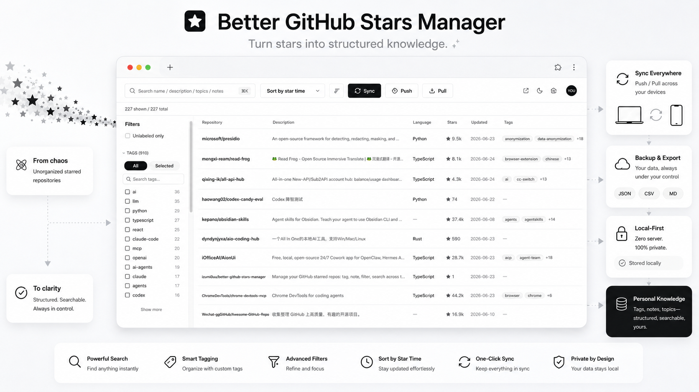
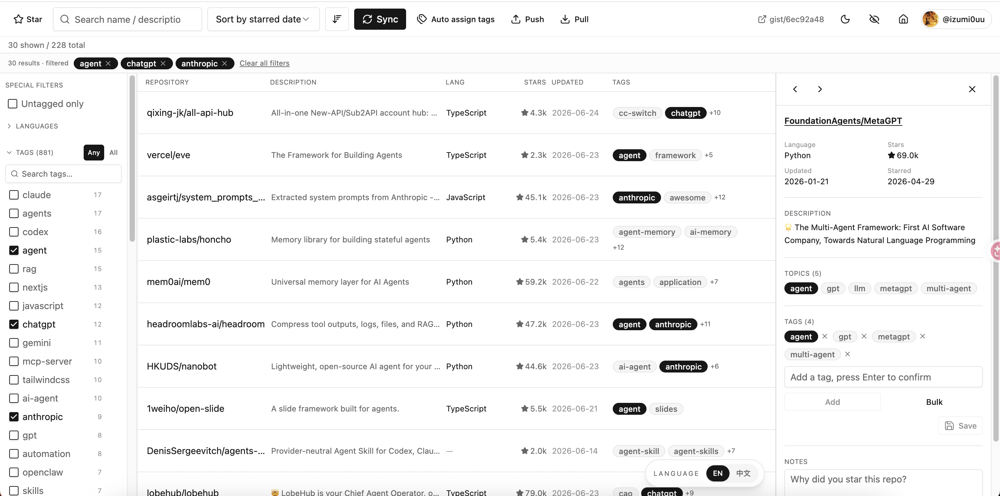
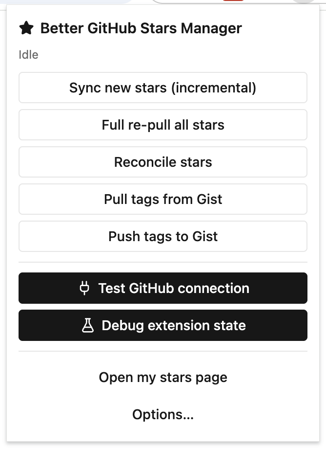

[简体中文](./README.md) · English

# Better GitHub Stars Manager

[](https://chromewebstore.google.com/detail/better-github-stars-manag/jbiacpcceoffcnmpepifoegagjopjpfa)
[](https://developer.chrome.com/docs/extensions/mv3/intro/)
[](https://www.typescriptlang.org/)
[](https://github.com/izumi0uu/better-github-stars-manager/releases)
[](./LICENSE)

> A Chrome extension for heavy GitHub users — local-first, zero-server, personal. It turns `https://github.com/{user}?tab=stars` into a fast, searchable, taggable, filterable, annotatable workspace so you can manage thousands of stars without leaving GitHub.

Install from the Chrome Web Store:
[Get it on the Chrome Web Store](https://chromewebstore.google.com/detail/better-github-stars-manag/jbiacpcceoffcnmpepifoegagjopjpfa)



## Table of Contents

- [Why Better GitHub Stars Manager?](#why-better-github-stars-manager)
- [Features](#features)
- [Screenshots](#screenshots)
- [How to Use](#how-to-use)
- [Install](#install)
- [Privacy and Storage](#privacy-and-storage)
- [Development](#development)
- [License](#license)
- [Contributing](#contributing)

## Why Better GitHub Stars Manager?

GitHub Stars is good for bookmarking, but it does not hold up for long-term organization.

Once your stars grow into the hundreds or thousands, the native list becomes hard to manage. In the AI era, GitHub projects multiply exponentially — you star all kinds of things, then forget where you saved them or what they were called. The real pain points:

- pagination hides the full picture of your stars
- no personal tagging system
- no real notes layer
- hard to revisit what you saved and why

Better GitHub Stars Manager makes GitHub Stars genuinely manageable for heavy users.

## Features

- **All stars in one place**
  Load your starred repositories into a virtualized table that stays usable even with very large collections.

- **Fast search and filtering**
  Search across repository name, description, topics, and notes. Filter by language, tags, and untagged items.

- **Floating toggle button**
  On your own GitHub stars page, a floating button switches to the management panel with one click.

- **Custom tags and notes**
  Add your own labels and notes so your stars become a working library instead of a passive list.

- **Auto-suggested tags**
  Turn repository topics and language into suggested tags with one click or in bulk.

- **Incremental sync and full rescan**
  Pull in newly starred repositories quickly, and run a full rescan when you want to reconcile unstars while keeping your annotations.

- **Repo-page tag chip**
  See and edit your tags directly on individual GitHub repository pages.

- **Watch Inbox**
  Group GitHub Notifications for current Stars by repository, with search, reason filters, mark-read, and mark-done actions.

- **Cross-device annotation sync**
  Push and pull your tags and notes through your own private GitHub Gist.

- **Gist-backed storage layer**
  Keep your annotation layer in a dedicated secret Gist so it is portable, recoverable, and easy to sync across devices without a backend.

## Screenshots

<p align="center">
  
  
</p>

## How to Use

1. Install the extension from the Chrome Web Store.
2. Open the extension, go to the Options page, and create a GitHub **Classic PAT**.
3. Visit your GitHub stars page: `https://github.com/{you}?tab=stars`.
4. Run **Sync** to import your stars.
5. Search, filter, tag, and add notes as you review repositories.
6. Use **Push** and **Pull** if you want your annotations to travel across devices.

## Install

Install Better GitHub Stars Manager from the Chrome Web Store:

[Get it on the Chrome Web Store](https://chromewebstore.google.com/detail/better-github-stars-manag/jbiacpcceoffcnmpepifoegagjopjpfa)

Then:

1. Click **Add to Chrome**
2. Open the extension **Options** page
3. Create a GitHub **Classic PAT** with the scopes below
4. Paste the token into Options and click **Save & verify**
5. Visit `https://github.com/{you}?tab=stars`
6. Run **Sync** to import your stars

Chrome will handle updates automatically after installation from the store.

### Token setup

Use the prefilled [Classic PAT form](https://github.com/settings/tokens/new?scopes=repo,gist,notifications,read:user&description=Better%20GitHub%20Stars%20Manager). Choose a name and finite expiration, review the scopes, generate the token, then paste it into Options and click **Save & verify**.

Scopes:

- **`repo`** (required): Stars sync, Star/Unstar, repository metadata, private repository access, and accessible Issue/Pull Request details.
- **`gist`** (required): cross-device annotation sync through the extension's private Gist.
- **`notifications`** (optional): Watch Inbox reads and notification actions. Without it, Stars and Gist continue to work.
- **`read:user`** (optional): Following Radar. Without it, Stars, Gist, and Watch continue to work.

Do not grant `user`, `user:email`, `user:follow`, `admin:org`, `workflow`, `delete_repo`, key, audit-log, enterprise, package, or Webhook administration scopes. They are not used by this extension.

If an older saved token needs authorization again, the extension keeps local Stars, tags, notes, and settings until the replacement passes verification.

The `gist` permission applies to the whole account. The extension creates a private Gist for annotation sync.

For the full scope-to-feature and future-feature guide, see [.trellis/spec/data/github-token-scopes.md](.trellis/spec/data/github-token-scopes.md).

For Watch scope, notification refresh, actions, and the 2026 GitHub Watching API risk, see [How Watch works](docs/watch-strategy.md). A [Chinese version](docs/watch-strategy.zh-CN.md) is also available.

### Another way --> Local development install

```bash
pnpm install
pnpm build
```

Then in Chrome:

1. Open `chrome://extensions`
2. Enable **Developer mode**
3. Click **Load unpacked**
4. Select the `dist/` folder
5. Open the extension **Options** page and continue with the token setup above

## Privacy and Storage

The extension is designed to keep the heavy data local and sync only the personal annotation layer.

- Star metadata is stored locally in IndexedDB.
- Lightweight config lives in `chrome.storage.local`.
- Tags, notes, and tag metadata can be stored in a dedicated secret Gist under your own GitHub account.

Push / Pull only sync your annotation layer:

- `Push` uploads tags, notes, and tag metadata to your private Gist.
- `Pull` merges the latest tags, notes, and tag metadata back into the local database.
- Star metadata itself stays local and is always reconstructed from GitHub.

There is no custom backend and no separate app account.

For a store-ready privacy statement, see [docs/privacy-policy.md](docs/privacy-policy.md).

For candidate sources, scoring, refresh policy, and the GitHub Explore boundary, see [How For You recommendations work](docs/for-you-recommendation-strategy.md). A [Chinese version](docs/for-you-recommendation-strategy.zh-CN.md) is also available.

## License

MIT — see [LICENSE](./LICENSE).

Copyright (c) 2026 izumi0uu.

## Friendly Links

- [Linux.do](https://linux.do/) [nodeseek](https://www.nodeseek.com/)
- [xiaoheihe](https://xiaoheihe.cn) [v2ex](https://www.v2ex.com/)

## Contributing

Issues and PRs are welcome at [the repository](https://github.com/izumi0uu/better-github-stars-manager/issues).
