[简体中文](./README.md) · English

<div align="center">
  

# Better GitHub Stars Manager

**Turn GitHub Stars into a searchable, organized, and maintainable personal dashboard.**

Search, filter, tag, and annotate repositories directly on your GitHub Stars page. Enable Watch, Following, For You, Secret Gist sync, or Cubby AI when you need them.

[](https://chromewebstore.google.com/detail/better-github-stars-manag/jbiacpcceoffcnmpepifoegagjopjpfa)
[](https://chromewebstore.google.com/detail/better-github-stars-manag/jbiacpcceoffcnmpepifoegagjopjpfa)
[](https://developer.chrome.com/docs/extensions/mv3/intro/)
[](https://www.typescriptlang.org/)
[](https://github.com/izumi0uu/better-github-stars-manager/releases)
[](./LICENSE)

  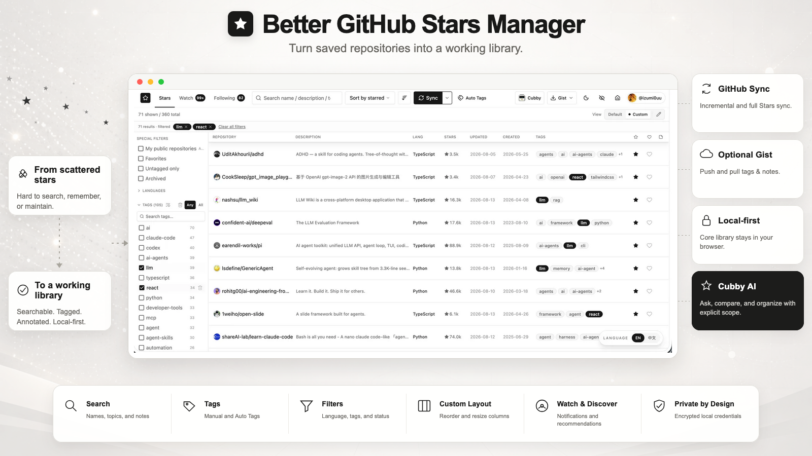

<sub>The product screenshot in this hero was supplied by the project maintainer and explicitly approved for public use; it shows the real interface with public GitHub data.</sub>
</div>

## Contents

- [Why this manager exists](#your-stars-can-be-a-personal-dashboard)
- [Features](#what-you-can-do) — Stars organization, Watch, discovery, and Cubby
- [Local-first data boundaries](#local-by-default-connected-when-you-choose)
- [Get started](#get-started) — [Install](#install) · [First sync](#run-the-first-sync)
- [Product boundaries](#what-it-does-not-do)
- [Local development](#local-development)
- [Related documentation](#related-documentation)
- [Contributing](#contributing) · [License](#license)
- [Links](#links) · [Friendly links](#friendly-links)

## Your Stars can be a personal dashboard

GitHub Stars makes it easy to browse saved repositories, but it is also easy to forget what you starred. Once the list grows beyond a few hundred entries, repository names alone rarely remind you why you saved them or what they do.

Better GitHub Stars Manager runs directly inside the Stars page. It organizes repository data, your custom tags, and notes in the browser while keeping GitHub's native Stars list available whenever you switch back.

| What you can do | GitHub Stars | Better GitHub Stars Manager |
|---|---|---|
| Organize by language and lists | Basic support | Combine language, tag, state, and owner filters |
| Review notifications from saved projects | Leave the Stars page | Optional Watch workspace |
| See what followed accounts have starred | Visit accounts separately | Optional Following workspace |
| Add custom tags | Not supported | Manual tags, Auto Tags, and favorites |
| Keep personal notes | Not supported | Supported and stored locally by default |
| Get repository recommendations | GitHub Explore | Optional For You with deterministic local ranking |
| Organize and compare all your Stars | Not supported | Optional Cubby AI |

## What you can do

### Organize your Stars

Use the Stars workspace to search and maintain your repository collection:

- Search repository names, descriptions, GitHub topics, and private notes
- Filter by language, tags, favorites, untagged state, archived state, or repositories you own
- Sort by starred date, latest push, creation date, star count, or name
- Add custom tags, private notes, and favorites
- Generate local Auto Tags in bulk from GitHub topics
- View and edit tags through the tag filter on GitHub repository pages
- Reorder, resize, show, or hide table columns, owner names, and owner avatars
- Hide the manager and return to GitHub's native Stars list

<div align="center">
  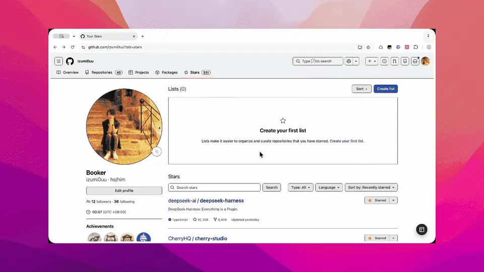
</div>

#### Edit Layout: customize the table

Click **Edit custom layout** in the toolbar to enter layout editing mode:

- **Drag to reorder**: Drag column headers to change column order. The insert position updates live, and sibling columns move aside
- **Drag to resize**: Drag column edges to adjust widths with a live readout, or reset all widths in one click
- **Show or hide columns**: Toggle visible columns from the **Columns** menu
- **Information density**: Toggle **Show repository owner** and **Show repository avatar** independently
- **Status and reset**: Switch freely between custom and default layouts, or use **Reset** to restore the default layout at any time
- **Persisted locally**: The extension saves the layout in `chrome.storage.local` and restores it on your next visit

<div align="center">
  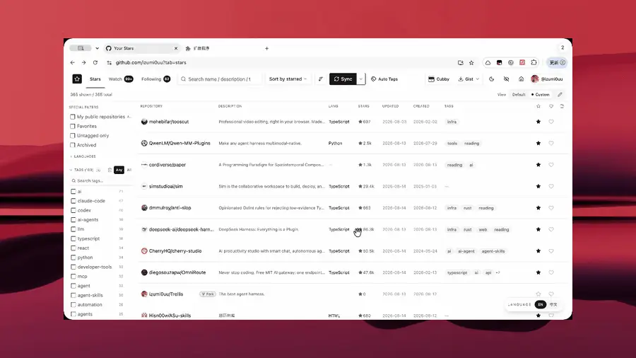
</div>

The virtualized list handles libraries with hundreds or thousands of rows. Incremental **Sync** fetches new Stars. **Full Sync** fetches all Stars and every public repository you own. A rescan reconciles unstarred repositories without deleting their existing tags or notes.

### Track project changes

Watch retrieves notifications from your GitHub inbox and organizes them in one workspace:

- Group unread or all notifications by repository
- Search repository names and notification titles, and filter by notification reason
- Fetch an Issue or Pull Request body, state, author, labels, assignees, and milestone on demand
- Mark one notification or an entire repository group as read or done

<div align="center">
  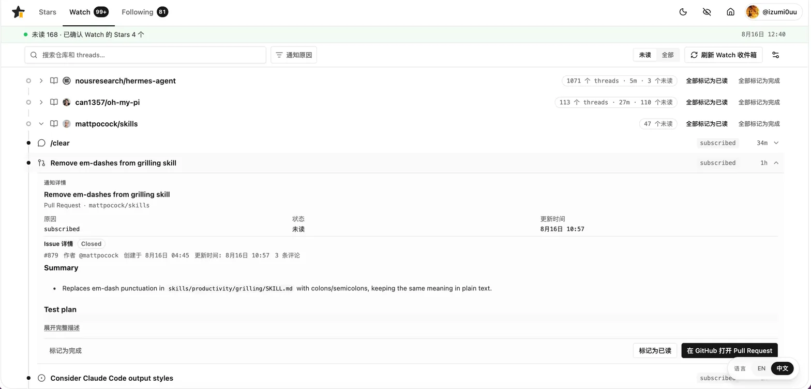
</div>

Watch Inbox requires the optional `notifications` scope on your Classic Personal Access Token (PAT). See [How Watch works](docs/en/watch-strategy.md) for its full behavior.

### Discover projects worth following

Following and For You offer two discovery paths:

- **Following activity**: Review public Star activity from people you follow over the last 30 days, with controls to search, hide items, star repositories, add favorites, and assign tags
- **For You**: Choose seeds from your existing Stars, fetch candidates through GitHub's public Search API, filter them, and recommend the results

For You excludes repositories you currently star, archived repositories, and forks. It uses supported GitHub APIs and does not reproduce GitHub Explore's private recommendation system. See [How For You recommendations work](docs/en/for-you-recommendation-strategy.md) for candidate sources, scoring, and daily refresh behavior.

Following requires the optional `read:user` scope. Without it, Stars, Gist, and Watch continue to work.

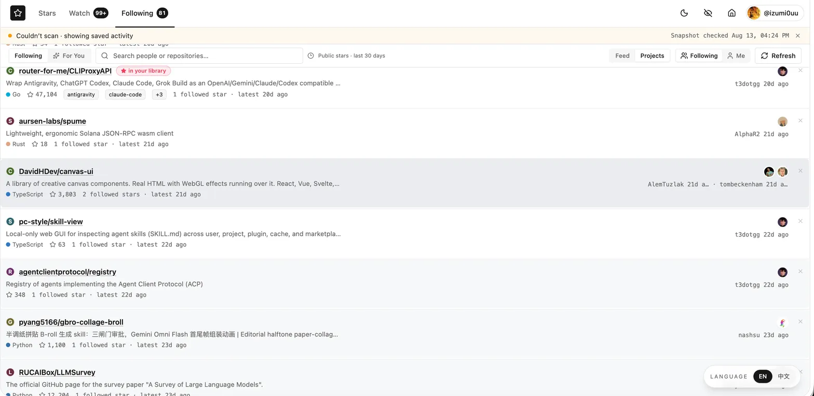

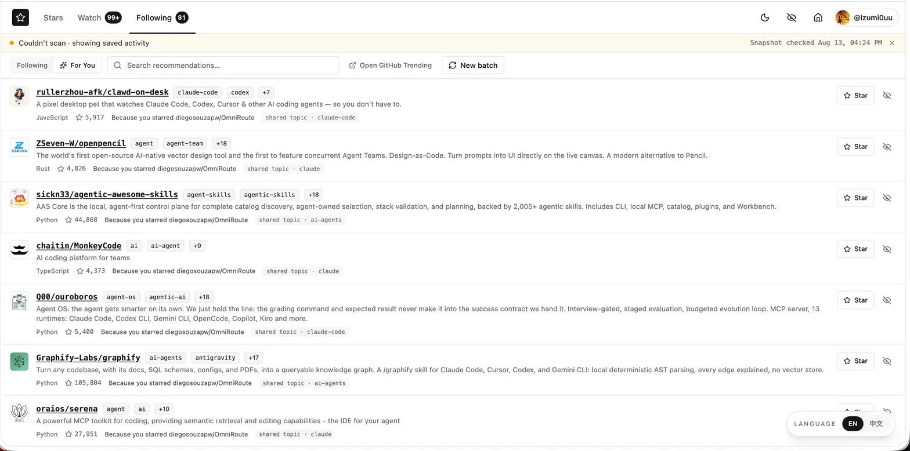

### Organize the library with Cubby 

Cubby is your assistant:

- **Summarize the library**: identify themes, technology stacks, and patterns in what you save
- **Compare projects**: combine repository data, topics, and public code to explain how similar repositories differ and where each fits
- **Find evidence**: read in-scope private notes or search public repository code only when needed for your request
- **Organize tags**: suggest tags backed by evidence; full-library **Organize** first completes read-only analysis, then hands the proposal to you for Review

Tag writes in regular conversations remain bounded by repository scope, same-turn evidence, and write limits. Organize writes only after you select suggestions and click **Apply**. Conversations, progress, and results persist in IndexedDB so work can recover after the page closes or the Manifest V3 service worker restarts.

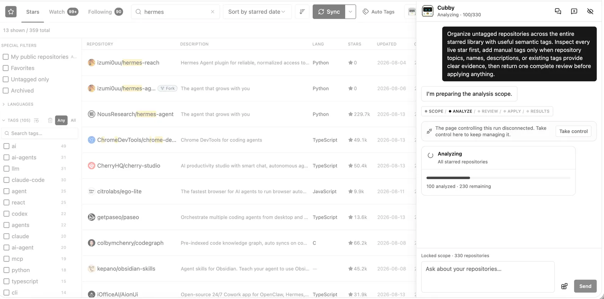

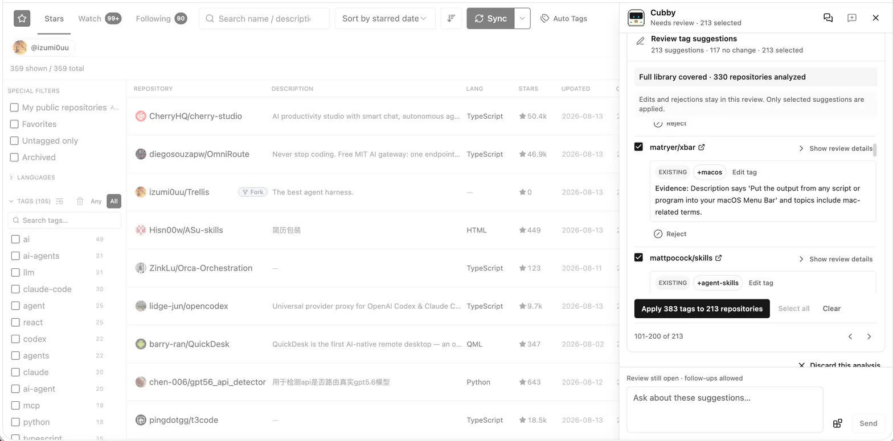

See the [Cubby Agent technical reference](docs/en/cubby-agent.md) for data boundaries, provider protocols, and recovery behavior.

## Local by default, connected when you choose

The core library stays in the current browser. Only GitHub synchronization, Secret Gist operations you start, and Cubby requests you make generate their corresponding network traffic.

| Capability | Storage | Network destination | Optional? |
|---|---|---|---|
| Stars, repository metadata, and filter state | IndexedDB and `chrome.storage.local` | GitHub API | Core |
| Tags, notes, favorites, and tag metadata | IndexedDB | None by default; GitHub Gist during Push or Pull | Gist transport is optional |
| Watch snapshots and notifications | IndexedDB | GitHub API | Optional `notifications` scope |
| Following snapshots and For You cache | IndexedDB | GitHub API | Following needs optional `read:user` scope |
| Cubby conversations, recovery records, and artifacts | IndexedDB | Your configured AI service | Optional |
| GitHub token and AI API key | Encrypted in `chrome.storage.local` | Sent only to their respective services | Configured per capability |

Secret Gist **Push** and **Pull** sync only the annotation layer. Repository metadata is rebuilt from GitHub. Watch, Following, For You, Cubby conversations, and Organize records never enter the Gist.

The GitHub token is encrypted locally; this protection is not equivalent to an operating-system keychain. Cubby conversations, recovery records, and artifacts remain unencrypted in the extension's IndexedDB. Uninstalling the extension removes Chrome's local extension storage but does not delete the sync Gist from your GitHub account.

The project operates no application backend, GitHub proxy, AI proxy, analytics SDK, ad network, or tracking service. Read the complete [privacy policy](docs/en/privacy-policy.md).

## Get started

### Install

| | Store | Works on |
| :---: | --- | --- |
| [](https://chromewebstore.google.com/detail/better-github-stars-manag/jbiacpcceoffcnmpepifoegagjopjpfa) | [Chrome Web Store](https://chromewebstore.google.com/detail/better-github-stars-manag/jbiacpcceoffcnmpepifoegagjopjpfa) | Chrome, Edge, Brave, Opera, and other Chromium-based browsers |
| [](https://microsoftedge.microsoft.com/addons) | [Edge Add-ons](https://microsoftedge.microsoft.com/addons) · Coming soon | Microsoft Edge |
| [](https://addons.mozilla.org/firefox/) | [Firefox Add-ons](https://addons.mozilla.org/firefox/) · Coming soon | Firefox |
| [](https://addons.opera.com/extensions/) | [Opera Add-ons](https://addons.opera.com/extensions/) · Coming soon | Opera |

<!-- TODO: replace the placeholder links above with the extension listing URLs once Edge, Firefox, and Opera are published -->

The extension uses Manifest V3. After installing, open `https://github.com/{you}?tab=stars`. The manager appears inside the Stars page.

### Run the first sync

1. Open the extension **Options** page
2. Create a GitHub Classic PAT with the `repo` and `gist` scopes
3. Add `notifications` for Watch and `read:user` for Following if you need those features
4. Paste the token and click **Save & verify**
5. Open `https://github.com/{you}?tab=stars` to start the extension automatically
6. On the first visit, **Full Sync** starts automatically

Open the prefilled [Classic PAT form](https://github.com/settings/tokens/new?scopes=repo,gist,notifications,read:user&description=Better%20GitHub%20Stars%20Manager) and follow the steps below.

<details>
<summary><strong>Open the illustrated GitHub token setup guide</strong></summary>

<br>

#### 1. Set the expiration

Keep the Note and choose a finite expiration.

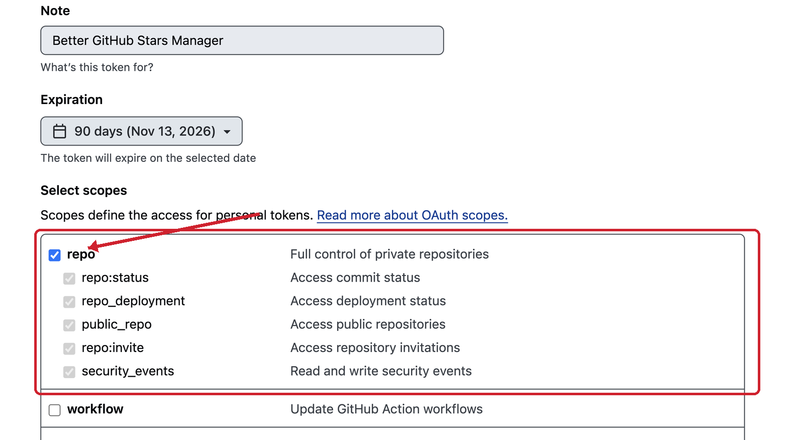

#### 2. Check the scopes

Keep `repo`, `gist`, `notifications`, and `read:user` selected. Leave `user` unselected.

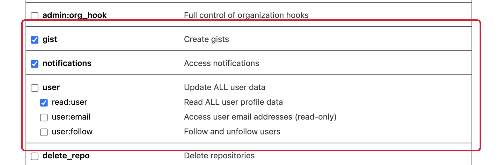

#### 3. Generate and save

Select **Generate token**, copy the token, paste it into **Options > GitHub Classic PAT**, then select **Save & verify**.

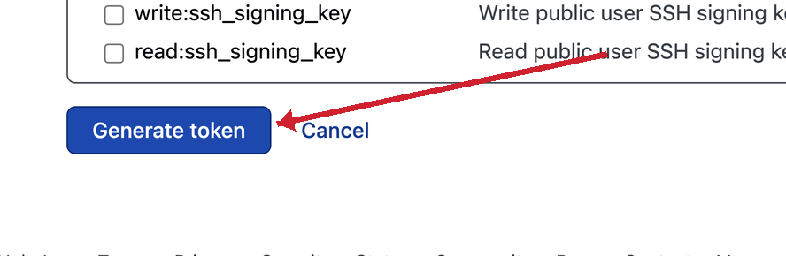

GitHub shows the token once. Keep it private.

</details>

## What it does not do

Better GitHub Stars Manager enhances the Stars page rather than replacing GitHub:

- **It does not change your Stars or Watch settings on its own**: it reads and organizes unless you explicitly take an action
- **It does not reproduce GitHub Explore**: For You uses public GitHub APIs and ranks candidates deterministically in the browser
- **It does not operate a backend or proxy**: Requests go directly to GitHub and the AI service you configure
- **It does not collect telemetry**: The project includes no analytics SDK, ad network, or tracking service
- **It does not read private notes automatically**: Cubby reads in-scope notes only when your request needs them

## Local development

This project uses pnpm. Build the extension:

```bash
pnpm install
pnpm build
```

Build the extension with Cubby Agent development diagnostics enabled (output: `artifacts/agent-diagnostics-dev-dist/`):

```bash
pnpm build:agent-dev-diagnostics
```

Load the build in Chrome:

1. Open `chrome://extensions`
2. Enable **Developer mode**
3. Click **Load unpacked**
4. Select the project's `dist/` directory
5. Open **Options** and configure the GitHub token described above

Common verification commands:

```bash
pnpm typecheck
pnpm test:logic
pnpm test:integration
pnpm test:regressions
pnpm test:runtime
pnpm test:smoke
```

## Related documentation

- [GitHub token permissions](docs/en/github-token-permissions.md)
- [How Watch works](docs/en/watch-strategy.md)
- [How For You recommendations work](docs/en/for-you-recommendation-strategy.md)
- [Cubby Agent technical reference](docs/en/cubby-agent.md)
- [Privacy policy](docs/en/privacy-policy.md)
- [Chrome Web Store update notes](docs/en/chrome-web-store-submission.md)
- [Firefox Add-ons submission reference](docs/en/firefox-amo-submission.md)

## Contributing

Report bugs and request features through [GitHub Issues](https://github.com/izumi0uu/better-github-stars-manager/issues). Pull requests are welcome.

## License

MIT License. See [LICENSE](./LICENSE).

Copyright (c) 2026 izumi0uu.

## Links

- [GitHub repository](https://github.com/izumi0uu/better-github-stars-manager)
- [Chrome Web Store](https://chromewebstore.google.com/detail/better-github-stars-manag/jbiacpcceoffcnmpepifoegagjopjpfa)
- [GitHub Issues](https://github.com/izumi0uu/better-github-stars-manager/issues)

## Friendly links

- [Linux.do](https://linux.do/) · [NodeSeek](https://www.nodeseek.com/)
- [小黑盒](https://xiaoheihe.cn/app/bbs/) · [V2EX](https://www.v2ex.com/)
