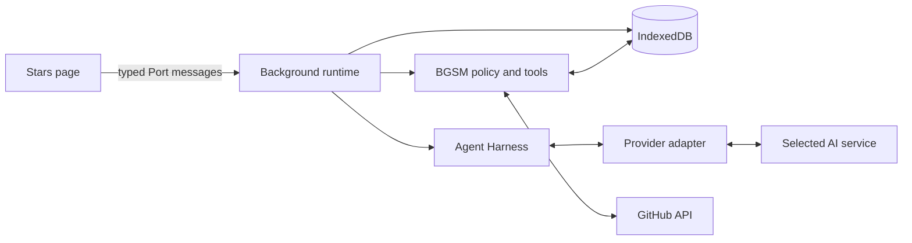

# Cubby agent technical reference

[简体中文](../zh/cubby-agent.md)

This reference explains Cubby's runtime boundaries, durable state, recovery model, and full-library Organize workflow. It is for maintainers reviewing behavior, not a release history or Chrome Web Store announcement.

- **Scope**: regular conversations, the Agent Harness, provider adapters, tools, and durable Organize jobs
- **Source of truth**: current source and behavioral tests
- **Core constraint**: the background service worker owns durable decisions; page state and model output never prove that a write committed

## Product boundary

Cubby places a provider-neutral control loop, the Agent Harness, between the selected artificial intelligence (AI) service and extension-owned data. Provider adapters translate wire protocols. Application policy decides which tools exist, what each tool may read or write, and what evidence a write requires.

Cubby has two execution paths:

| Path | Use | Write boundary |
| --- | --- | --- |
| Regular turn | Conversation over a bound selected-repository or current-view scope | Bounded tag tools may write after runtime authorization and same-turn evidence checks |
| Organize | Classification across a frozen library scope | Analysis is read-only; selected changes write only after Review and Apply |

Cubby does not run autonomous background goals, expose filesystem or shell tools, delegate to other agents, or persist hidden reasoning. Provider-managed sessions are not authoritative.

## Ownership model

Each layer owns one part of the system:

| Layer | Responsibility |
| --- | --- |
| Page controller | Starts, stops, reconnects, renders progress, and acknowledges terminal delivery |
| Background composition root | Registers Chrome listeners synchronously and constructs one runtime graph per worker epoch |
| Background runtime | Admits launches, binds conversations, and coordinates attempts; it owns no Chrome listener |
| IndexedDB storage | Stores canonical messages, attempts, recovery records, artifacts, and Organize jobs |
| Agent Harness | Runs the provider-neutral loop, assembles complete tool calls, applies budgets, and returns one terminal result |
| BGSM policy | Builds the scoped tool registry and enforces authorization, write policy, compaction, and artifact rules |
| Provider adapter | Converts OpenAI-compatible, OpenAI Responses, or Anthropic traffic into normalized runtime events |

The page is a projection. A loading state, broadcast, or delivered model message cannot authorize a write or replace a durable record.

## Regular turns

A regular turn follows one durable sequence:

1. The page sends the prompt, repository scope candidate, attempt identity, and current session revision.
2. The turn registry rejects stale revisions, conflicting attempts, and malformed launches.
3. The turn service checks for a stored receipt, loads canonical history, and derives the attempt's recovery class.
4. The attempt coordinator stores the admitted launch and acquires a lease bound to the current worker epoch.
5. The turn service resolves and revalidates the scope and provider binding, builds scoped tools and trusted instructions, then starts the Agent Harness.
6. A provider adapter streams normalized events. The harness assembles and validates a complete tool call before any tool can run.
7. Tool results and artifact checkpoints persist under the lease. The terminal transaction stores the transcript transition and receipt, settles the attempt, and clears the durable lease.
8. The background publishes one terminal result. The page applies and acknowledges it; that acknowledgement controls delivery-buffer cleanup and prevents a finalized result from replaying.

A repeated launch with a stored receipt replays that receipt without calling the provider or tools again. A page detach does not stop work; a reconnect can resume delivery. An explicit Stop aborts provider and tool work through the attempt's cancellation signal.

Canonical conversation history lives in IndexedDB. Provider requests receive a bounded projection plus current instructions, scope, tools, and observations. The rendered chat is also a projection and can be rebuilt from durable data.

## Tools and authorization

The tool catalog records each tool's capability, risk, visibility, presentation, evidence source, and write policy. The runtime applies these checks in order:

1. Assemble the complete streamed call. Partial or malformed calls never execute.
2. Validate the tool name and arguments against the local schema.
3. Evaluate catalog risk, conversation state, same-turn evidence, write budget, and write policy.
4. Enforce repository scope and result bounds during execution.
5. Persist the tool effect, return one structured result, and account for any change.

Ordinary turns register local-star, repository-code, and private-note tools. Tag-write and Organize handoff tools depend on conversation state. `read_agent_artifact` is exposed through a continuation-only registry while required artifact coverage is pending. Trusted instructions tell the model to use code and private notes only when the request calls for them. This is an instruction-level rule: the runtime does not semantically classify the prompt.

The runtime still enforces hard boundaries. Repository reads stay inside the bound scope, note reads do not count as write evidence, and injected repository text cannot grant permission. Once a repository-code read engages the conversation's read-only latch, write tools are unavailable. Ordinary tag writes are also blocked while an Organize Apply is sealed, running, or paused.

Tag writes commit through extension-owned storage code, not provider output. The terminal receipt records the outcome and change count, but it is not the data authority for individual tag rows.

## Durable state and MV3 recovery

Chrome Manifest V3 (MV3) can replace the background service worker between messages. Cubby therefore treats worker memory and session caches as disposable.

Durable state includes:

- canonical session messages and the current revision
- admitted attempts, leases, terminal receipts, and retry state
- bounded continuation records for interrupted artifact traversal
- conversation-owned artifacts and their coverage records
- Organize jobs, items, apply rows, and receipts

Every lease includes the worker epoch and launch identity. Commits require the exact lease and base revision, so an old worker cannot publish after a replacement takes ownership.

Recovery depends on what storage can prove:

- A stored terminal receipt is replayed.
- A statically read-only attempt may be reacquired. If it has an artifact checkpoint, traversal resumes at that checkpoint; otherwise provider and read-only work may run again from canonical history.
- An interrupted attempt that could have written becomes `state_uncertain`. Cubby fails closed until the user explicitly abandons it.
- Damaged recovery state blocks a new launch until the user explicitly discards that recovery record.

This distinction matters because a tag tool can commit before the final transcript transition. After worker loss, the tag row may be durable even when Cubby cannot prove the terminal result.

## Organize workflow

Organize is separate from ordinary conversation because library-wide work needs a frozen scope, reviewable proposals, and resumable writes.

1. **Confirm scope**: the background creates a short-lived preflight, then freezes the current live Stars set into a durable job.
2. **Analyze**: bounded batches of public metadata go to the selected provider. Analysis persists progress and never writes tags.
3. **Review**: the user sees the complete proposal and selects rows. No tag changes occur in this stage.
4. **Apply**: selected rows are sealed. Before each write, Cubby reloads the current row and compares `sourceFingerprint` plus the sealed taxonomy fingerprint.
5. **Record**: changed, unchanged, skipped, and failed rows appear in a durable receipt.

Stale source data is skipped instead of overwritten. Analysis failures and exhausted run budgets preserve a continuation point. A later worker can continue from persisted state instead of restarting the library.

One controller and conversation own a nonterminal job. Other surfaces are observers until the user chooses **Take control**. Cancelling before Apply produces a terminal cancelled job; once Apply starts, pause and resume preserve the sealed selection.

## Context, compaction, and artifacts

Canonical history remains intact. Cubby compacts only the provider projection, and only at protocol-safe boundaries before a turn or after a complete assistant-and-tool envelope. A summary cannot replace or rewrite canonical messages.

Large successful tool results stay in local artifacts. The provider receives an opaque pointer and can read bounded pages through `read_agent_artifact`. Cursor progress and artifact integrity are checkpointed with the attempt. Cubby cannot finalize while required artifact coverage is missing or incomplete.

Search and byte-offset artifact reads help locate content but do not prove full traversal. Re-fetchable cache may expire without deleting canonical conversation evidence.

## Privacy and security boundaries

Cubby can send the selected provider the prompt, bounded conversation projection, selected or frozen repository metadata, visible tags, tool observations, and requested public code or scoped private notes. See the [privacy policy](privacy-policy.md) for the user-facing disclosure and retention rules.

Private-note and repository-code tools are available in ordinary turns. Trusted instructions restrict their use to requests that call for those data, but no runtime classifier determines semantic intent. The runtime enforces scope, authorization, and result bounds. Notes, code, repository text, artifact pages, and provider output remain untrusted input and cannot change policy.

Provider credentials are bound to the selected provider and canonical origin. The API key is added only to the request header. It does not enter prompts, tool payloads, or release logs. The GitHub token is never sent to an AI service, and provider traffic does not pass through a developer-operated proxy.

Release diagnostics store bounded facts, counts, relative paths, and digests. Development-only raw capture requires an explicit one-shot action and is excluded from release builds.

## Change checklist

When changing a Cubby boundary:

1. Update the owning source contract before its projections.
2. Test the smallest runtime behavior that proves the contract.
3. Add packaged MV3 coverage when the change crosses Ports, storage, worker recovery, or provider transport.
4. Review privacy and Web Store disclosures when provider-visible data or host access changes.
5. Keep this reference conceptual. Put exact limits and state validation in source and behavioral tests.

## Source map

| Concern | Primary source |
| --- | --- |
| Harness and provider protocols | [`src/agent-harness`](../../src/agent-harness) |
| Tool catalog, authorization, compaction, and artifacts | [`src/bgsm-agent`](../../src/bgsm-agent) |
| Runtime composition, listeners, and turn delivery | [`src/background/index.ts`](../../src/background/index.ts), [`src/background/bgsm-agent-runtime.ts`](../../src/background/bgsm-agent-runtime.ts), [`src/background/bgsm-agent-turn-port.ts`](../../src/background/bgsm-agent-turn-port.ts) |
| Turn orchestration | [`src/background/bgsm-agent-turn-service.ts`](../../src/background/bgsm-agent-turn-service.ts), [`src/background/agent-attempt-coordinator.ts`](../../src/background/agent-attempt-coordinator.ts) |
| Canonical sessions and attempts | [`src/storage/agent-session-store.ts`](../../src/storage/agent-session-store.ts), [`src/storage/agent-attempt-model.ts`](../../src/storage/agent-attempt-model.ts) |
| Organize state and writes | [`src/background/organize-job-controller.ts`](../../src/background/organize-job-controller.ts), [`src/storage/organize-job-store.ts`](../../src/storage/organize-job-store.ts) |
| UI projections | [`src/ui/agent-client-controller.ts`](../../src/ui/agent-client-controller.ts), [`src/ui/agent-workbench-state.ts`](../../src/ui/agent-workbench-state.ts) |
| Behavioral coverage | [`tests/unit/background-agent-turn-contract.test.ts`](../../tests/unit/background-agent-turn-contract.test.ts), [`tests/unit/bgsm-agent-authorization.test.ts`](../../tests/unit/bgsm-agent-authorization.test.ts), [`tests/runtime/agent-worker-recovery-extension-host.mjs`](../../tests/runtime/agent-worker-recovery-extension-host.mjs) |
