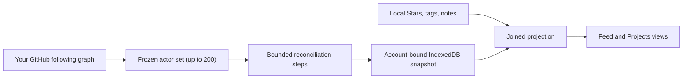

# How Following works

This document explains how Following builds its activity feed: which accounts it scans, how a full reconciliation survives interruption, what the local snapshot stores, and which coverage gaps are permanent. Read the [Chinese version](../zh/following-strategy.md).

## Purpose and scope

Following answers one question: which public repositories have the people you follow on GitHub starred recently. It is a discovery surface, not a notification inbox. Rows are grouped either as a flat newest-first feed or aggregated by repository.

Following is not a GitHub activity stream. It doesn't read commits, releases, issues, or follows-of-follows, and it never infers activity from repository metadata.

## What Following shows

Each row carries the actor who starred, the repository, its language and star count, when the star happened, and whether the repository is already in your library. Local annotations join in at projection time, so a repository you already tagged shows those tags inline.

The history window is a preference: 30, 60, or 90 days. Changing it invalidates the saved full-scan baseline, because the previous scan proved coverage only for the previous window.

## Which accounts are scanned

Following scans **up to 200 accounts**, ordered by GitHub's own following pagination, which returns most recently followed first. Accounts beyond that cap are never scanned.

The cap is a product boundary, not a GitHub limit. It bounds worst-case quota spend for a surface that refreshes hourly in the background. When it applies, the snapshot records a distinct reason and the interface says how many accounts are covered, so a partial result is never presented as a complete one.

That reason is deliberately separate from a GitHub-side gap. Reaching the cap is stable and expected; failing to page the following graph is a transient scan failure. Only the second one makes the extension prefer a full scan on the next wake.

## How a full reconciliation works

A full scan cannot finish in one request. GitHub exposes the following graph and each account's starred repositories through separate paginated GraphQL connections, and the extension's service worker can be replaced at any time. Following therefore persists a versioned checkpoint in IndexedDB and advances it through bounded steps.

One step:

1. Pages the following graph until the actor set can freeze.
2. Requests starred repositories for pending actors, five actors per request.
3. Stops at the first resumable boundary and returns exactly one checkpoint revision.

Each step's limits:

| Control | Current behavior |
|---|---|
| Following page size | 100 accounts |
| Followed-account cap | 200 accounts |
| Actors per activity request | 5 |
| Starred repositories per actor page | 30 |
| Requests per step | 10 |
| Step deadline | 120s |
| Request timeout | 30s |
| Transient retry attempts | 3 per request position |
| Quota reserve | 50 points kept unspent |
| Automatic check | Every hour |
| Full-scan interval | Every 7 days |

Three boundaries pause a step without losing progress: the request budget, the step deadline, and the quota reserve. A pause is not a failure. The stored cursor, the fetched rows, and the accumulated coverage gaps all survive, and the next compatible refresh continues from that cursor rather than restarting at the newest page.

When quota is healthy, consecutive steps run inside the same wake, so a large following graph converges in minutes rather than across many hourly alarms. The chain stops as soon as another full step would spend below the quota reserve, so an interrupted scan never starves Stars sync, Watch, or Cubby of GitHub quota. Only a request-budget pause may chain at all: a deadline pause means the wake is already slow, and a quota pause is a hard wait until GitHub's reset time. Chaining also stops whenever the remaining quota or the step's request cost is unknown, because an unmeasured step could spend past the reserve.

The cutoff is frozen when the epoch starts. A resume hours later still covers the window the scan promised, so rows never shift under a partially completed scan.

## Which state can delete rows

Full-scan provenance and deletion authority are separate, and this distinction is the core storage rule.

Walking every frozen actor to the frozen cutoff records that a full scan completed. Deleting rows requires strictly more: the frozen actor set must cover the entire following graph, with no reported coverage gap at all. A capped or gapped epoch cannot prove that a row it never observed was unstarred, so it merges what it found and deletes nothing.

Consequences worth stating plainly:

- A paused, failed, or abandoned epoch never deletes activity.
- An epoch that hit the 200-account cap never deletes activity.
- Local `seen` and dismissed state survives every step, including the terminal one.
- Changing account, credential, or history window abandons incompatible progress without touching saved rows.

## Refresh routing

An unfinished compatible checkpoint takes precedence over normal policy: automatic refresh, Refresh, and Full sync all continue that epoch. Without a checkpoint, the extension chooses:

| Situation | Plan |
|---|---|
| No saved baseline | Full |
| Previous attempt failed | Full |
| History window changed | Full |
| Credential or account changed | Full |
| Last full scan is 7+ days old | Full |
| Otherwise | Incremental, fixed 7-day lookback |

A permanent coverage gap does not force a full scan. Re-running a full scan cannot retrieve activity GitHub will not return for that window, so escalating on it would spend quota every hour with no new data.

Failures record a cooldown floor so an automatic refresh cannot retry the same failure without pause. An explicit Full sync passes that cooldown, because the user asked. A GitHub quota wait blocks every caller including an explicit request.

## Storage and privacy

GitHub remains authoritative for the following graph and for star events. IndexedDB stores an account-bound cache:

- `radarActivities`: normalized star events with local `seen` and dismissed state
- `radarState`: refresh timestamps, coverage counts, quota metadata, error state, and the private reconciliation checkpoint

The checkpoint never crosses the background-to-interface boundary. Public status carries only phase, completed and total counts, update time, pause reason, and resume time. Actor logins, GraphQL cursors, epoch identifiers, and credential fingerprints stay inside the storage and source layers.

Following data never enters tags, tag metadata, the annotation Gist, logs, telemetry, or Cubby by default. Changing the GitHub account clears the previous account's Following cache.

## Credentials and permissions

Following reads the GitHub GraphQL API with the saved Classic personal access token. It needs `read:user` to page the following graph. Without that scope Following is unavailable; Stars, Gist sync, and Watch continue to work.

Private repository activity is omitted rather than shown, and that omission is recorded as a coverage gap.

## Supported and unsupported behavior

| Area | Supported now | Not supported |
|---|---|---|
| Scanned accounts | Up to 200 most recently followed | The complete following graph beyond that cap |
| Activity kinds | Public star events | Commits, releases, issues, follows, or forks |
| History | 30, 60, or 90 rolling days | Arbitrary ranges or complete history |
| Convergence | Resumable steps, chained while quota allows | An atomic point-in-time snapshot of GitHub |
| Deletion | Only a complete, gap-free epoch prunes rows | Pruning from a partial or capped epoch |
| Annotations | Local tags, notes, and stars join at projection | Writing Following state back to GitHub |
| Sync | Local account-bound IndexedDB cache | Gist sync or cross-device Following state |

## References

- [GitHub GraphQL API reference](https://docs.github.com/en/graphql/reference/queries)
- [GitHub GraphQL resource limitations](https://docs.github.com/en/graphql/overview/rate-limits-and-node-limits-for-the-graphql-api)
- [GitHub REST API endpoints for starring](https://docs.github.com/en/rest/activity/starring)
- [GitHub Classic PAT scopes](https://docs.github.com/en/apps/oauth-apps/building-oauth-apps/scopes-for-oauth-apps)
