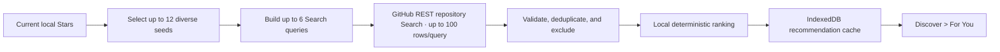

# How For You recommendations work

This document explains how For You selects, ranks, stores, and refreshes public repository recommendations. It also defines the supported GitHub application programming interface (API) boundary and the guarantees that future changes must preserve. Read the [Chinese version](../zh/for-you-recommendation-strategy.md).

## Purpose and scope

For You helps you discover public repositories related to repositories you already starred. It uses supported GitHub APIs and a local, deterministic ranking model. It isn’t GitHub Explore, and the interface must not imply that it reproduces GitHub’s private recommendations.

The recommendation cache is derived and disposable. Canonical Stars, tags, notes, favorites, and tombstone state remain separate.

## Current pipeline

The pipeline reads canonical local Stars, retrieves a bounded public candidate pool, and publishes one account-scoped snapshot. Each stage has deterministic ordering and explicit limits.

### 1. Seed selection

The extension reads live, currently starred rows from local IndexedDB. It ignores tombstones and rows where GitHub says `viewer_has_starred` is false.

It selects at most 12 seeds. Newer stars are considered first, while per-language and per-owner caps keep one ecosystem or organization from monopolizing the query plan. The selected seed data is limited to repository name, owner, language, topics, star time, and star count.

Implementation: `selectRecommendationSeeds()` in `src/recommendations/recommendation-model.ts`.

### 2. Candidate retrieval

The extension derives four signal types from the selected seeds:

- Repository topics
- Primary language
- Repository owner
- Meaningful tokens from the repository name

It builds at most six stable Search queries. Each query requests the first page of at most 100 repositories, sorted by stars. Queries exclude archived repositories and forks and apply these minimum star counts:

| Signal | Search constraint |
|---|---:|
| Topic | 10 stars |
| Language | 25 stars |
| Owner | 5 stars |
| Repository-name token | 10 stars |

Each request has a 20s timeout, and the complete refresh has a 75s deadline. GitHub Search has a separate authenticated rate limit. The extension stores the lowest observed remaining count and latest reset time instead of retrying during cooldown.
If a successful response reports zero remaining Search requests, the source stops the remaining queries and ranks the candidates already fetched. A request error still aborts the refresh without replacing the saved snapshot.

A completed snapshot may contain fewer than 60 rows. GitHub can return fewer eligible, unique repositories after validation and exclusion.

Implementation: `buildRecommendationQueryPlan()` and `fetchGitHubRecommendations()` in `src/recommendations/recommendation-model.ts` and `src/api/github-recommendation-source.ts`.

### 3. Validation and exclusion

Every Search response is treated as untrusted input. A candidate must have a valid GitHub HTTPS URL, repository identity, owner, star count, topics, archive state, and fork state before it can enter the cache.

Before ranking, the extension removes:

- Repositories already in your current local Stars
- Archived repositories
- Forks
- Duplicate Search results
- Candidates with no measurable relationship to any selected seed

The final list is capped at 60 repositories.

### 4. Local ranking

Each candidate is compared with every selected seed. The strongest relationship supplies both the base score and the explanation shown in the UI.

| Signal | Base score |
|---|---:|
| Shared topic | $80 + 12 \times \min(\text{shared topics}, 3)$ |
| Same language | 50 |
| Same owner | 38 |
| Related repository-name token | 22 |

Two bounded auxiliary signals are then added:

- **Popularity**: $\min(24, 6 \log_{10}(\text{stars} + 1))$
- **Freshness**: $\max(0, 18 - 3 \log_2(\text{days since last push} + 1))$

The result is sorted by score, then star count, then canonical repository key. Those tie-breakers make the same inputs produce the same order. The UI displays `Because you starred …` plus the winning topic, language, owner, or name signal so the recommendation remains explainable.

### 5. Persistence and batch replacement

Dedicated IndexedDB tables store the published list and refresh state. The state records the account, attempt time, success time, error, cooldown, candidate count, seed count, query count, and Search rate-limit observations.

A successful refresh replaces the candidate cache and state in one transaction. A failed, cancelled, timed-out, or rate-limited refresh preserves the last successful list. The UI can therefore show saved recommendations while it refreshes or reports stale data.

The **New batch / 换一批** command starts a new GitHub Search refresh. It doesn’t paginate or rotate local groups. It publishes the new snapshot only after the bounded fetch completes without an error and validation and ranking succeed.

Concurrent entry, schedule, and manual triggers for the same credential identity share one in-flight refresh. If the credential identity changes before publication, the coordinator discards the old result.

### 6. First load and daily refresh

The refresh policy separates first-load discovery, daily maintenance, startup catch-up, and manual replacement:

| Trigger | Eligibility | Result |
|---|---|---|
| First extension entry | Valid main GitHub credential, at least one live local Star, and no prior successful snapshot | Fetch the first snapshot once |
| Daily alarm | Existing successful snapshot and a valid main credential | Refresh at the next device-local 08:00 boundary |
| Service-worker startup or wake | The previous success is from an earlier local day, today is after 08:00, and no attempt has run today | Make one catch-up attempt |
| **New batch / 换一批** | Valid main GitHub credential and no active cooldown | Start a manual replacement |

The daily job uses a one-shot `chrome.alarms` alarm, not a fixed 24-hour interval. After each alarm, the scheduler computes the next local 08:00 from the current timezone. This preserves local wall-clock behavior across timezone and daylight-saving changes.

The scheduler installs a daily alarm only after the account has a successful snapshot. It removes the alarm when the account or credential is no longer eligible. Startup reconciliation repairs missing or obsolete alarms.

Entry signals come from Popup, Options, and the Stars-page content script. They remain opportunistic: an ineligible entry returns without a request or a visible error. The coordinator also suppresses same-day startup retries and blocks requests until `nextAllowedAt` during a Search cooldown.

Implementation: `createRecommendationRefreshCoordinator()` in `src/background/recommendation-refresh.ts`, `createScheduledRefreshController()` in `src/background/scheduled-refresh.ts`, and `signalRecommendationEntry()` in `src/utils/recommendation-entry.ts`.

### 7. Starring a recommendation

Recommendations don’t enter canonical Stars merely because For You suggested them. When you click **Star**, the extension:

1. Calls GitHub’s supported `PUT /user/starred/{owner}/{repo}` endpoint
2. Reads canonical repository metadata from GitHub
3. Writes the repository to the local Stars table
4. Broadcasts the data change and reloads the recommendation projection

This targeted synchronization doesn’t wait for a full-library sync. The newly starred repository disappears from For You and becomes available in local Stars after the mutation completes.

## Refresh and error contracts

Refresh failures use stable product states. Saved candidates remain queryable while the same account retains a valid main credential. Removing that credential, changing accounts, or explicitly clearing recommendations removes the derived cache.

| Condition | State | Cache behavior | Retry behavior |
|---|---|---|---|
| No valid main credential | `not_configured` | Account-bound data is reconciled | No automatic request |
| No completed refresh | `never_loaded` | No published rows | First eligible entry may fetch |
| Success within 24 hours | `fresh` | New snapshot is visible | Daily or manual policy applies |
| Saved snapshot older than 24 hours, or a later refresh failed | `stale` | Saved snapshot remains visible | Daily, catch-up, or manual policy applies |
| Failure before any success | `error` | No published rows | Manual retry or later eligible trigger |
| Search rate limit active | `cooldown` | Saved snapshot remains visible | Requests wait until `nextAllowedAt` |

The source maps authentication, permission, rate-limit, abort, deadline, network, GitHub service, content-type, response-shape, and candidate-shape failures to stable `RecommendationErrorCode` values. It never publishes a partial refresh after one planned request fails.

## Implementation guardrails

Future changes must preserve these contracts:

- Keep canonical Stars and disposable recommendations in separate tables
- Exclude tombstones, unstarred rows, existing Stars, archived repositories, forks, duplicates, and unrelated candidates
- Keep seed, query, per-query result, timeout, deadline, and final snapshot limits explicit
- Preserve deterministic ordering for fixed seeds, candidates, and fetch time
- Atomically replace a complete snapshot and preserve the previous snapshot on failure
- Share concurrent refreshes for one credential identity and reject results from a changed identity
- Compute daily refreshes from local calendar boundaries, not fixed Coordinated Universal Time (UTC) offsets or 24-hour periods
- Keep first-entry and catch-up checks silent when they aren’t eligible
- Use supported GitHub APIs only; don’t scrape Explore or depend on undocumented endpoints

The required tests cover model limits and ordering, Search validation and failures, storage replacement and account isolation, refresh coalescing, entry eligibility, local 08:00 boundaries, catch-up suppression, alarm repair, UI batch replacement, and the extension browser smoke path.

## Why this can’t reproduce GitHub Explore’s private recommendation graph

GitHub documents personalized Explore recommendations based on your activity. GitHub doesn’t document a supported REST or GraphQL endpoint for Explore candidates, scores, model features, or feedback state.

The public data surfaces have narrower contracts:

- Repository Search returns repositories that match an explicit query. It doesn’t return Explore’s personalized ranking
- Stars endpoints read or mutate the authenticated account’s Stars. They don’t expose GitHub’s recommendation graph
- Personal dashboard documentation covers activity such as people you follow starring repositories. It doesn’t define Explore ranking
- `User.viewerRelevantRepositories` is being renamed to `viewerCopilotChatRepositorySuggestions`. It serves Copilot Chat repository suggestions, not the general Explore recommender

An Explore clone would require private inputs that GitHub doesn’t expose: the complete user-to-repository interaction graph, impression and click history, negative feedback, learned embeddings, model weights, candidate-recall services, abuse controls, experiments, and final scores. Scraping GitHub’s interface or undocumented endpoints would create a session-dependent and unsupported contract.

For You makes a narrower promise: supported GitHub data, bounded requests, local deterministic ranking, explicit reasons, and no Explore parity claim.

## Limits of the current model

The current model favors bounded, explainable retrieval over broad or learned personalization.

- Only public Search candidates are recommended.
- Candidate recall uses a bounded Search plan; GitHub Search itself has scope, timeout, rate, and result limits, so a valid snapshot may contain fewer than 60 rows.
- A Star is a useful preference signal but does not reveal why the user starred a repository or whether the interest is still current.
- Popularity and freshness are bounded formulas, not learned personalization.
- The current model has no negative-feedback or click-history signal.
- Search results and repository metadata can change between refreshes even though ranking is deterministic for a fixed input snapshot.

## GitHub API references

These GitHub documents define the supported API and product boundaries used by this strategy.

- [GitHub: Discovering projects on GitHub](https://docs.github.com/en/get-started/exploring-projects-on-github/discovering-projects-on-github)
- [GitHub REST API: Search repositories](https://docs.github.com/en/rest/search/search#search-repositories)
- [GitHub REST API: Starring](https://docs.github.com/en/rest/activity/starring)
- [GitHub: Personal dashboard](https://docs.github.com/en/account-and-profile/reference/personal-dashboard)
- [GitHub GraphQL breaking changes](https://docs.github.com/en/graphql/overview/breaking-changes)
