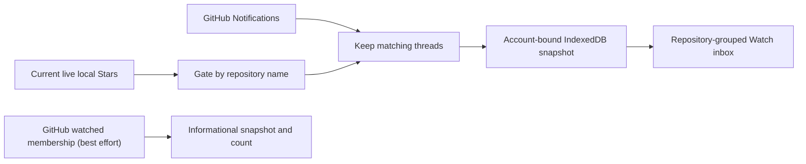

# How Watch works

This document explains how Watch selects repositories, reads GitHub Notifications, stores a local snapshot, and changes notification state. It also records a current GitHub API gap: Custom subscriptions can produce notification threads for repositories that never appear in the watched-repository endpoint, and that endpoint may lose access. Read the [Chinese version](../zh/watch-strategy.md).

## Purpose and scope

Watch gives you a focused inbox for repositories you currently Star on GitHub. It groups GitHub notification threads by repository so you can review activity without leaving the Stars workspace. Native watched membership is kept as a separate, best-effort informational snapshot; it never decides which threads appear.

Watch is not a repository activity feed. It doesn't infer activity from commits, releases, or repository metadata. It also doesn't include notifications from repositories outside your current Stars library.

## What Watch shows

Watch displays normalized GitHub notification threads for repositories in the current live Stars set. Each row can include:

- repository name
- notification title and subject type
- GitHub's notification reason
- unread state
- update time
- a validated GitHub link

The interface supports **Unread** and **All** views. You can search repository names and titles, filter by reason, and collapse repository groups. New or changed threads reopen a previously collapsed group.

Expanding an Issue or Pull Request can load its details with the main GitHub credential. The detail panel can show state, author, labels, assignees, milestone, comment count, and description. Other subject types keep their notification summary and GitHub link.

## Watched membership and Inbox scope

Watch keeps two independent projections:

- **Inbox scope** comes from your current live local Stars (`!tombstone && viewer_has_starred !== false`). Every published notification thread must belong to a repository in that set.
- **Native watched membership** is a best-effort informational snapshot from `GET /user/subscriptions`, fetched at 100 repositories per page. It answers "which of my current Stars do I also Watch on GitHub?" and is shown as an informational count.

The extension intersects the watched-membership snapshot with current Stars so the count stays relevant. The snapshot excludes repositories you have unstarred and local tombstones.

Scope refresh follows these rules:

- A failed or malformed page invalidates that refresh; a partial result never replaces the previous snapshot.
- A successful refresh replaces the previous snapshot atomically.
- A failed refresh preserves the last successful snapshot and marks it stale.
- Scope refresh never blocks Inbox refresh, and scope replacement never deletes Inbox rows.

Watch never treats absence from `GET /user/subscriptions` as proof that a repository is unwatched: GitHub Custom subscriptions can generate notification threads for repositories that never appear in that endpoint.

## How notifications are refreshed

Watch reads `GET /notifications` only when the saved Classic personal access token (PAT) has Notifications access. The request includes `all=true`, so the snapshot can contain read and unread threads. GitHub returns threads newest first.

Published threads are intersected with the current live Stars library; native watched membership does not filter the Inbox. A Custom-category thread for a currently starred repository can appear even when that repository is absent from `GET /user/subscriptions`. Notifications from repositories outside the live Stars library remain excluded.

Each refresh uses these limits and controls:

| Control | Current behavior |
|---|---|
| Page size | 50 threads, the GitHub endpoint maximum |
| Page limit | 10 pages |
| Candidate limit | 500 threads |
| Snapshot boundary | One frozen `before` timestamp per refresh |
| Request timeout | 30s per page |
| Automatic Inbox check | Every minute, subject to GitHub's poll interval |
| Watched-scope check | Every hour |

The extension sends the committed `Last-Modified` value on the first page. A `304 Not Modified` response keeps cached threads that are still in the current live Stars set, prunes any rows that left that set, and updates the refresh time. A conditional `200` is treated as a delta, merged by thread ID, and committed through the same live-Stars transaction fence.

Watch also respects `X-Poll-Interval`. The **Refresh** action makes no network request while the stored cooldown remains active. If more than 500 candidate threads exist, Watch publishes the valid newest window and labels it truncated.

## Notification actions

Watch currently exposes two GitHub Inbox actions:

| Watch action | GitHub request | Result in Watch |
|---|---|---|
| **Mark as read** | `PATCH /notifications/threads/{thread_id}` | Sets the cached row to read |
| **Mark as done** | `DELETE /notifications/threads/{thread_id}` | Removes the cached row |

Both actions change GitHub first. Watch updates IndexedDB only after GitHub succeeds. Repository-level bulk actions target every cached row in that repository, not only rows visible after a local search or reason filter.

GitHub's APIs also support repository subscription changes and thread subscription changes. Watch doesn't call those endpoints. Use [GitHub's watched repositories page](https://github.com/watching) to change Watch, Custom, Ignore, and unwatch settings.

Watch also doesn't expose Save, mark-unread, unsubscribe, custom Inbox filters, or the GitHub Done archive. **Mark as done** removes the row from the local Watch projection after GitHub accepts the action.

## Credentials and permissions

The current product uses one encrypted GitHub Classic PAT. Watch depends on:

- `notifications` for notification reads and thread actions
- `repo` for the product's private-repository contract and accessible Issue or Pull Request details

GitHub's Notifications REST API accepts `notifications` or `repo`. The explicit `notifications` scope keeps the optional Watch capability visible in the token setup. Missing Notifications access disables Watch without disabling Stars or Gist sync.

GitHub documents broader powers under `notifications`, including repository watch changes and thread subscription writes. The extension doesn't exercise those powers. Never add broader scopes for Watch.

## Storage and privacy

GitHub remains authoritative for watched membership and notification state. IndexedDB stores an account-bound cache:

- `watchRepositories`: canonical repository names from the best-effort watched-membership snapshot
- `watchNotificationThreads`: normalized notification rows
- `watchState`: refresh timestamps, errors, validators, cooldown, counts, and truncation state

Issue and Pull Request details use a bounded in-memory cache and aren't persisted. The main token stays encrypted in `chrome.storage.local`; plaintext exists only in memory.

Watch data never enters tags, tag metadata, the annotation Gist, logs, telemetry, or Cubby by default. Changing the GitHub account clears the old account's Watch cache. Disconnecting Watch clears notification rows and Watch refresh state while preserving Stars and annotations.

## Current GitHub API gaps

GitHub announced new Watching API restrictions in July 2026. Its current REST documentation says access to subscriber and subscription listing endpoints will be limited to administrators and collaborators. GitHub also says the public `GET /users/{username}/subscriptions` endpoint is deprecated and may return an empty response before removal.

The announcement names the public user endpoint explicitly, while the Watching overview uses broader wording about subscription listing endpoints. The authenticated `GET /user/subscriptions` endpoint still appears in the reference, but GitHub no longer gives a durable availability guarantee for this product's use case.

GitHub Custom subscriptions add a second gap: they can generate `/notifications` threads for repositories that never appear in `GET /user/subscriptions`. Watch therefore never uses absence from the watched list as an exclusion, and it still doesn't infer Custom categories or claim complete watch membership.

These gaps affect only the informational watched-membership snapshot. The Inbox no longer depends on it: `GET /user/subscriptions` returning `403` or an empty list can degrade the snapshot or count, but it never blocks notification refresh or hides threads for live Stars.

Use these product rules until GitHub clarifies or replaces the endpoint:

1. Never fall back to `GET /users/{username}/subscriptions`; GitHub has deprecated it.
2. Never scrape `https://github.com/watching` or repository pages.
3. Preserve the last successful snapshot when GitHub returns an error.
4. Treat a successful empty authenticated response cautiously in product messaging.
5. Don't claim that Watch can always enumerate every repository you watch.

The current implementation atomically accepts a successful empty `GET /user/subscriptions` response. If GitHub starts returning policy-driven empty responses for the authenticated endpoint, that behavior will erase the cached snapshot. This is a known compatibility gap, not evidence that you stopped watching every repository.

## Future direction

The current design already removes the global watched-list dependency: the Notifications feed is the inbox source, and threads are intersected directly with current live local Stars. Watch means "GitHub Inbox threads for current Stars," not "all current Stars that you watch." The watched-list can only become a stronger source again if GitHub exposes Custom-category membership.

A second option checks `GET /repos/{owner}/{repo}/subscription` for selected repositories. It can answer one repository at a time, but a library-wide scan creates one request per Star. The extension must not add that fan-out without explicit limits and rate-limit validation.

Repository subscription writes can be added only as an explicit feature. They must use the existing `notifications` scope, confirm the requested repository, and avoid bulk defaults. They don't solve watched-list discovery.

## Supported and unsupported behavior

| Area | Supported now | Not supported |
|---|---|---|
| Inbox scope | Current live Stars gate which repositories appear | Repositories outside the Stars library or another user's watched list |
| Native watched membership | Best-effort `GET /user/subscriptions` snapshot and count | Complete watch membership, Custom-category inference, or subscription editing |
| Inbox | Read and unread GitHub threads in a bounded newest window | Complete activity history or GitHub's full Inbox archive |
| Details | Lazy Issue and Pull Request details | Comments, review timeline, commit details, release details, or discussions inline |
| Local filters | Unread/All, title and repository search, reason filters | GitHub custom-filter synchronization |
| Mutations | Mark read and mark done | Save, mark unread, unsubscribe, thread mute, Watch/Custom/Ignore changes |
| Sync | Local account-bound IndexedDB cache | Gist sync, cross-device Watch state, or AI-service export |

## References

- [GitHub REST API endpoints for notifications](https://docs.github.com/en/rest/activity/notifications)
- [GitHub REST API endpoints for watching](https://docs.github.com/en/rest/activity/watching)
- [GitHub notification concepts](https://docs.github.com/en/subscriptions-and-notifications/concepts/about-notifications)
- [GitHub notification Inbox management](https://docs.github.com/en/subscriptions-and-notifications/how-tos/viewing-and-triaging-notifications/managing-notifications-from-your-inbox)
- [GitHub's June 30, 2026 Watching access-restrictions announcement](https://github.blog/changelog/2026-06-30-upcoming-access-restrictions-to-public-api-endpoints-and-ui-views/)
- [GitHub Classic PAT scopes](https://docs.github.com/en/apps/oauth-apps/building-oauth-apps/scopes-for-oauth-apps)
