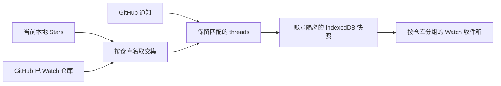

# Watch 如何工作

本文说明 Watch 如何选择仓库、读取 GitHub 通知、保存本地快照，以及修改通知状态。本文也记录一项当前的 GitHub API 风险：Watch 依赖的仓库成员关系接口可能失去访问能力。另见 [English version](./watch-strategy.md)。

## 目标与边界

Watch 为同时被你 Star 和 Watch 的 GitHub 仓库提供一个聚焦的收件箱。它按仓库组织 GitHub 通知 thread，让你不离开 Stars 工作台也能查看动态。

Watch 不是仓库活动流。它不会根据 commit、release 或仓库元数据推测活动，也不会纳入当前 Stars 库之外的仓库通知。

## Watch 显示什么

Watch 显示当前交集内仓库的规范化 GitHub 通知 thread。每一行可以包含：

- 仓库名
- 通知标题和 subject 类型
- GitHub 返回的通知原因
- 未读状态
- 更新时间
- 经过校验的 GitHub 链接

界面提供 **未读** 和 **全部** 两种视图。你可以搜索仓库名和标题、按原因筛选，以及折叠仓库分组。出现新增或更新的 thread 时，之前折叠的分组会重新展开。

展开 Issue 或 Pull Request 后，扩展可以使用主 GitHub 凭据读取详情。详情面板可以显示状态、作者、labels、assignees、milestone、评论数量和描述。其他 subject 类型仍显示通知摘要和 GitHub 链接。

## 如何选择仓库范围

Watch 目前把 `GET /user/subscriptions` 作为已 Watch 仓库的来源。它以每页 100 个仓库读取全部分页。任何一页失败或格式错误都会让本轮刷新失败，因此部分结果不会替换上一次范围。

扩展将完整响应与本地 Stars 取交集，并排除：

- 你已经取消 Star 的仓库
- 本地 tombstone
- 由你拥有、但不在当前 Stars 中的仓库
- 交集范围之外仓库的通知

范围刷新成功后，扩展会原子替换旧成员关系。刷新失败时，扩展保留上一次成功快照并将其标记为 stale。

## 如何刷新通知

只有保存的 Classic personal access token（PAT）具备 Notifications 访问能力时，Watch 才会读取 `GET /notifications`。请求包含 `all=true`，因此快照可以同时包含已读和未读 thread。GitHub 按更新时间从新到旧返回 threads。

每轮刷新采用以下限制与控制：

| 控制项 | 当前行为 |
|---|---|
| 每页数量 | 50 个 threads，即 GitHub 接口上限 |
| 分页上限 | 10 页 |
| 候选上限 | 500 个 threads |
| 快照边界 | 每轮刷新共用一个固定的 `before` 时间 |
| 请求超时 | 每页 30s |
| Inbox 自动检查 | 每分钟一次，并服从 GitHub 的轮询间隔 |
| Watch 范围检查 | 每小时一次 |

扩展会在第一页发送已经提交的 `Last-Modified` 值。收到 `304 Not Modified` 时，扩展保留缓存 threads 并更新时间。带条件请求收到 `200` 时，扩展把响应视为增量，并按 thread ID 合并。

Watch 也会遵守 `X-Poll-Interval`。已保存的冷却时间尚未结束时，点击 **刷新** 不会发出网络请求。如果候选 thread 超过 500 个，Watch 会发布有效的最新窗口，并将其标记为 truncated。

## 通知操作

Watch 目前提供两项 GitHub Inbox 操作：

| Watch 操作 | GitHub 请求 | Watch 中的结果 |
|---|---|---|
| **标记为已读** | `PATCH /notifications/threads/{thread_id}` | 将缓存行改为已读 |
| **标记为完成** | `DELETE /notifications/threads/{thread_id}` | 删除缓存行 |

两项操作都会先修改 GitHub。只有 GitHub 成功后，Watch 才会更新 IndexedDB。仓库级批量操作会作用于该仓库的全部缓存行，而不只是本地搜索或原因筛选后仍可见的行。

GitHub API 还支持修改仓库订阅和 thread 订阅。Watch 不会调用这些接口。请前往 [GitHub 已 Watch 仓库页面](https://github.com/watching) 修改 Watch、Custom、Ignore 和取消 Watch 设置。

Watch 也不提供 Save、标记为未读、取消订阅、自定义 Inbox 筛选器，或 GitHub Done 归档。GitHub 接受 **标记为完成** 后，Watch 会从本地投影中移除该行。

## 凭据与权限

当前产品使用一个加密保存的 GitHub Classic PAT。Watch 依赖：

- `notifications`：读取通知和执行 thread 操作
- `repo`：满足产品的私有仓库契约，并读取你有权访问的 Issue 或 Pull Request 详情

GitHub Notifications REST API 接受 `notifications` 或 `repo`。显式选择 `notifications` 可以让可选的 Watch 能力在 token 配置中保持清晰。缺少 Notifications 访问能力时，只会禁用 Watch，不会禁用 Stars 或 Gist 同步。

GitHub 文档说明 `notifications` 还允许修改仓库 Watch 状态和 thread 订阅。扩展不会使用这些能力。不要为 Watch 添加更宽的权限。

## 存储与隐私

GitHub 是 Watch 成员关系和通知状态的规范来源。IndexedDB 保存一份账号隔离的缓存：

- `watchRepositories`：当前范围内的规范仓库名
- `watchNotificationThreads`：规范化通知行
- `watchState`：刷新时间、错误、validators、冷却时间、数量和 truncated 状态

Issue 和 Pull Request 详情只进入有上限的内存缓存，不会持久化。主 token 加密保存在 `chrome.storage.local`，明文只存在于内存。

Watch 数据不会进入 tags、tag metadata、批注 Gist、日志、遥测，默认也不会进入 Cubby。切换 GitHub 账号会清除旧账号的 Watch 缓存。断开 Watch 会清除通知行和 Watch 刷新状态，但保留 Stars 和批注。

## 当前 GitHub API 风险

GitHub 在 2026 年 7 月宣布新的 Watching API 访问限制。当前 REST 文档称，subscriber 和 subscription 列表接口将仅限管理员与协作者访问。GitHub 也明确表示，公开的 `GET /users/{username}/subscriptions` 接口已经弃用，并可能在正式移除前返回空响应。

公告明确点名了公开用户接口，而 Watching 概览对 subscription 列表接口使用了更宽泛的描述。认证接口 `GET /user/subscriptions` 目前仍出现在参考文档中，但 GitHub 不再为本产品的使用场景提供持久可用性保证。

这给 Watch 带来了规范来源风险。如果平台策略让 `GET /user/subscriptions` 返回 `403` 或空列表，扩展无法区分“受策略限制”和“用户确实没有 Watch 任何仓库”。

在 GitHub 澄清或替换该接口之前，产品应遵循以下规则：

1. 不要回退到 `GET /users/{username}/subscriptions`，GitHub 已经弃用该接口。
2. 不要抓取 `https://github.com/watching` 或仓库页面。
3. GitHub 返回错误时，保留上一次成功范围。
4. 产品文案应谨慎处理认证接口成功返回空列表的情况。
5. 不要承诺 Watch 总能枚举你 Watch 的每一个仓库。

当前实现会原子接受 `GET /user/subscriptions` 成功返回的空响应。如果 GitHub 开始让认证接口因策略返回空响应，这个行为会清空缓存范围。这是已知兼容性缺口，不代表你真的取消 Watch 了全部仓库。

## 后续方向

风险最低的后续设计会移除对全局已 Watch 列表的依赖。它可以直接使用 Notifications feed 作为收件箱来源，再与当前本地 Stars 取交集。这样可以保留通知处理能力，但必须修改产品承诺：Watch 将表示“当前 Stars 的 GitHub Inbox threads”，不再表示“你 Watch 的全部当前 Stars”。

另一种方案是对选定仓库调用 `GET /repos/{owner}/{repo}/subscription`。该接口可以逐个回答仓库状态，但全库扫描会为每个 Star 产生一次请求。没有明确上限和限流验证前，扩展不得增加这种 fan-out。

只有形成明确功能后，才可以增加仓库订阅写操作。它必须沿用现有 `notifications` scope，确认目标仓库，并避免默认批量操作。订阅写操作无法解决已 Watch 列表发现问题。

## 支持与不支持的行为

| 领域 | 当前支持 | 不支持 |
|---|---|---|
| 仓库范围 | 当前 Stars 与认证用户 Watch 成员关系的交集 | 任意仓库或其他用户的已 Watch 列表 |
| Inbox | 有上限的最新窗口中的已读和未读 GitHub threads | 完整活动历史或 GitHub 完整 Inbox 归档 |
| 详情 | 按需读取 Issue 和 Pull Request 详情 | 内联评论、review timeline、commit 详情、release 详情或 discussion 详情 |
| 本地筛选 | 未读/全部、标题与仓库搜索、原因筛选 | 同步 GitHub 自定义筛选器 |
| 修改操作 | 标记为已读、标记为完成 | Save、标记为未读、取消订阅、静音 thread、修改 Watch/Custom/Ignore |
| 同步 | 账号隔离的本地 IndexedDB 缓存 | Gist 同步、跨设备 Watch 状态或导出到 AI 服务 |

## 参考资料

- [GitHub Notifications REST API](https://docs.github.com/en/rest/activity/notifications)
- [GitHub Watching REST API](https://docs.github.com/en/rest/activity/watching)
- [GitHub 通知概念](https://docs.github.com/en/subscriptions-and-notifications/concepts/about-notifications)
- [GitHub 通知 Inbox 管理](https://docs.github.com/en/subscriptions-and-notifications/how-tos/viewing-and-triaging-notifications/managing-notifications-from-your-inbox)
- [GitHub 2026 年 6 月 30 日 Watching 访问限制公告](https://github.blog/changelog/2026-06-30-upcoming-access-restrictions-to-public-api-endpoints-and-ui-views/)
- [GitHub Classic PAT scopes](https://docs.github.com/en/apps/oauth-apps/building-oauth-apps/scopes-for-oauth-apps)
