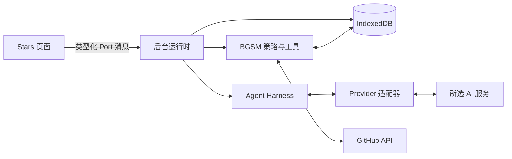

# Cubby Agent 技术参考

[English](../en/cubby-agent.md)

本文说明 Cubby 的运行边界、持久化状态、恢复方式和全库 Organize 工作流，供维护者核对行为。它不是开发日志，也不是 Chrome Web Store 更新说明。

- **范围**：普通对话、Agent Harness、Provider 适配器、工具和持久化 Organize 任务
- **事实依据**：当前源码和行为测试
- **核心约束**：后台 Service Worker 决定持久化状态；页面状态和模型输出都不能证明写入已经提交

## 产品边界

Cubby 在所选 AI 服务和扩展自有数据之间运行一层与 Provider 无关的控制循环，也就是 Agent Harness。Provider 适配器负责转换网络协议；应用策略决定有哪些工具、每个工具能读写什么，以及写入需要哪些证据。

Cubby 有两条执行路径：

| 路径 | 用途 | 写入边界 |
| --- | --- | --- |
| 普通回合 | 在绑定的单仓库或当前视图范围内对话 | 有界标签工具通过运行时授权和本轮证据检查后可以写入 |
| Organize | 对冻结的全库范围进行分类 | 分析阶段只读；只有 Review 中选中的变更才会在 Apply 阶段写入 |

Cubby 不会自主执行后台目标，也没有文件系统、Shell 或多 Agent 工具。它不保存隐藏推理，Provider 自己的会话状态也不是事实依据。

## 所有权模型

每一层只负责自己的边界：

| 层 | 职责 |
| --- | --- |
| 页面控制器 | 启动、停止和重连，显示进度，并确认收到终态结果 |
| 后台组合根 | 同步注册 Chrome 监听器，并为每个 worker epoch 创建一个运行时图 |
| 后台运行时 | 接纳请求、绑定对话并协调 attempt；它本身不持有 Chrome 监听器 |
| IndexedDB 存储 | 保存规范消息、attempt、恢复记录、artifact 和 Organize 任务 |
| Agent Harness | 运行与 Provider 无关的循环，组装完整工具调用，应用预算，并返回唯一终态结果 |
| BGSM 策略 | 创建有范围限制的工具注册表，执行授权、写入、压缩和 artifact 规则 |
| Provider 适配器 | 把 OpenAI-compatible、OpenAI Responses 或 Anthropic 流量转换为统一的运行时事件 |

页面只是投影。加载状态、广播或已送达的模型消息都不能授权写入，也不能替代持久化记录。

## 普通回合

一个普通回合按以下顺序执行：

1. 页面发送提示词、候选仓库范围、attempt 标识和当前会话 revision。
2. Turn registry 拒绝过期 revision、冲突 attempt 和格式错误的启动请求。
3. Turn service 检查是否已有 receipt，加载规范历史，并确定 attempt 的恢复类别。
4. Attempt coordinator 保存已接纳的启动信息，并取得绑定当前 worker epoch 的 lease。
5. Turn service 解析并重新验证范围与 Provider 绑定，创建有范围限制的工具和可信指令，然后启动 Agent Harness。
6. Provider 适配器输出统一事件。Harness 必须组装并验证完整的工具调用，之后工具才可能执行。
7. 工具结果和 artifact checkpoint 在 lease 下持久化。终态事务保存 transcript 变更与 receipt，结算 attempt，并清除持久化 lease。
8. 后台发布一个终态结果。页面应用并确认；这次确认负责清理投递缓冲，并防止已结束结果再次重放。

如果同一启动请求已经有持久化 receipt，后台会直接重放 receipt，不再调用 Provider 或工具。页面断开不会停止任务，重新连接后可以继续接收结果；用户明确点击 Stop 才会通过 attempt 的取消信号中止 Provider 和工具工作。

完整对话历史保存在 IndexedDB。Provider 只收到有界投影，以及当前指令、范围、工具和观察结果。界面显示的聊天记录同样是投影，可以从持久化数据重建。

## 工具与授权

工具目录为每个工具记录 capability、risk、visibility、展示方式、证据来源和写入策略。运行时按以下顺序处理调用：

1. 组装完整的流式调用；残缺或格式错误的调用不会执行。
2. 用本地 schema 验证工具名和参数。
3. 检查目录风险、对话状态、本轮证据、写入预算和写入策略。
4. 执行时限制仓库范围和结果大小。
5. 持久化工具效果，返回一个结构化结果，并记录变更数量。

普通回合会注册本地 Stars、仓库代码和私有笔记工具。标签写入与 Organize 交接工具是否出现取决于对话状态。只有所需 artifact 覆盖仍待完成时，continuation 专用注册表才会提供 `read_agent_artifact`。可信指令要求模型只在请求需要时使用代码和私有笔记。这是指令层规则，运行时不会对提示词做语义分类。

运行时仍会强制执行硬边界：仓库读取不能超出绑定范围，笔记读取不能成为写入证据，仓库中的注入文本也不能授予权限。一次成功的仓库代码读取会启用对话级只读锁，此后不再提供写入工具。Organize Apply 处于已封存、执行中或暂停状态时，普通对话也不能写标签。

标签写入由扩展自己的存储代码提交，不由 Provider 输出直接决定。终态 receipt 会记录结果和变更数量，但具体标签行仍以存储数据为准。

## 持久化状态与 MV3 恢复

Chrome Manifest V3（MV3）可能在两条消息之间替换后台 Service Worker，因此 Cubby 把 worker 内存和会话缓存都视为可丢弃数据。

持久化状态包括：

- 规范会话消息和当前 revision
- 已接纳的 attempt、lease、终态 receipt 和重试状态
- artifact 遍历中断时使用的有界 continuation 记录
- 对话所属的 artifact 及其覆盖记录
- Organize 任务、条目、Apply 行和 receipt

每个 lease 都包含 worker epoch 和启动标识。提交必须匹配原始 lease 与 base revision，已经失去所有权的旧 worker 不能继续发布结果。

恢复方式取决于存储能够证明什么：

- 已有终态 receipt 时直接重放。
- 可以证明为静态只读的 attempt 可以重新认领。有 artifact checkpoint 时从该位置继续；没有时，可以根据规范历史重新执行 Provider 和只读工作。
- 可能执行过写入的中断 attempt 会进入 `state_uncertain`。用户明确放弃前，Cubby 会拒绝继续。
- 损坏的恢复记录会阻止新请求，直到用户明确丢弃该记录。

这里不能只看 transcript。标签工具可能已经提交，但终态 transcript 变更还没来得及写入；worker 在这时消失，标签行可能已经持久化，而 Cubby 无法证明最终结果。

## Organize 工作流

Organize 与普通对话分开，因为全库操作需要冻结范围、可审核提案和可恢复写入。

1. **确认范围**：后台创建短期 preflight，然后把当前有效 Stars 集合冻结到持久化任务中。
2. **分析**：选定 Provider 分批读取有界的公开元数据。分析会保存进度，不写标签。
3. **Review**：用户查看完整提案并选择条目；此阶段没有标签变更。
4. **Apply**：所选条目被封存。每次写入前，Cubby 都会重新读取当前行，并比较 `sourceFingerprint` 和已封存的 taxonomy fingerprint。
5. **记录**：持久化 receipt 记录 changed、unchanged、skipped 和 failed 条目。

源数据过期时会跳过，而不是覆盖。分析失败或单次运行预算耗尽时，任务会保留 continuation；新的 worker 可以从持久化位置继续，不必重跑整个库。

一个非终态任务只属于一个控制器和对话。其他界面只能观察，直到用户点击 **Take control**。Apply 前取消会产生终态 cancelled 任务；Apply 开始后，暂停和恢复都保留已封存的选择。

## 上下文、压缩与 artifact

规范历史不会被改写。Cubby 只压缩发送给 Provider 的投影，而且只能在协议完整的边界执行：回合开始前，或一组完整 assistant 与 tool 消息之后。摘要不能替代规范消息。

过大的成功工具结果会留在本地 artifact 中，Provider 只收到不透明指针，并通过 `read_agent_artifact` 分页读取。游标进度和 artifact 完整性随 attempt 一起保存。所需覆盖仍缺失或不完整时，Cubby 不能提交最终结果。

搜索和字节偏移读取可以帮助定位内容，但不能证明已经完整遍历。可重新获取的缓存可以过期，不会因此删除规范对话证据。

## 隐私与安全边界

Cubby 可能把提示词、有界对话投影、所选或冻结范围内的仓库元数据、可见标签、工具观察结果，以及请求所需的公开代码或有范围限制的私有笔记发送给所选 Provider。面向用户的数据披露和保留规则见[隐私政策](privacy-policy.md)。

普通回合会注册私有笔记和仓库代码工具。可信指令要求 Cubby 只在请求需要相应数据时使用它们，但没有运行时分类器判断语义意图。运行时负责限制范围、授权和结果大小。笔记、代码、仓库文本、artifact 页面和 Provider 输出都是不可信输入，不能修改策略。

Provider 凭据绑定到选定 Provider 和规范化服务地址。API Key 只加入请求 Header，不会进入提示词、工具载荷或发布版日志。GitHub Token 永远不会发送给 AI 服务，Provider 流量也不经过开发者运营的代理。

发布版诊断只保存有界事实、计数、相对路径和摘要。开发版原始抓取需要用户明确执行一次性启用操作，并且不会进入发布构建。

## 修改检查

修改 Cubby 边界时：

1. 先修改拥有该契约的源码，再修改它的投影。
2. 用最小的运行时行为测试证明契约。
3. 改动跨越 Port、存储、worker 恢复或 Provider 传输时，补充打包后的 MV3 验证。
4. Provider 可见数据或主机访问发生变化时，检查隐私政策和 Web Store 披露。
5. 本文只保留稳定概念；精确限制和状态校验留在源码与行为测试中。

## 源码索引

| 关注点 | 主要源码 |
| --- | --- |
| Harness 与 Provider 协议 | [`src/agent-harness`](../../src/agent-harness) |
| 工具目录、授权、压缩与 artifact | [`src/bgsm-agent`](../../src/bgsm-agent) |
| 运行时组合、监听器与 turn 投递 | [`src/background/index.ts`](../../src/background/index.ts)、[`src/background/bgsm-agent-runtime.ts`](../../src/background/bgsm-agent-runtime.ts)、[`src/background/bgsm-agent-turn-port.ts`](../../src/background/bgsm-agent-turn-port.ts) |
| Turn 编排 | [`src/background/bgsm-agent-turn-service.ts`](../../src/background/bgsm-agent-turn-service.ts)、[`src/background/agent-attempt-coordinator.ts`](../../src/background/agent-attempt-coordinator.ts) |
| 规范会话与 attempt | [`src/storage/agent-session-store.ts`](../../src/storage/agent-session-store.ts)、[`src/storage/agent-attempt-model.ts`](../../src/storage/agent-attempt-model.ts) |
| Organize 状态与写入 | [`src/background/organize-job-controller.ts`](../../src/background/organize-job-controller.ts)、[`src/storage/organize-job-store.ts`](../../src/storage/organize-job-store.ts) |
| UI 投影 | [`src/ui/agent-client-controller.ts`](../../src/ui/agent-client-controller.ts)、[`src/ui/agent-workbench-state.ts`](../../src/ui/agent-workbench-state.ts) |
| 行为覆盖 | [`tests/unit/background-agent-turn-contract.test.ts`](../../tests/unit/background-agent-turn-contract.test.ts)、[`tests/unit/bgsm-agent-authorization.test.ts`](../../tests/unit/bgsm-agent-authorization.test.ts)、[`tests/runtime/agent-worker-recovery-extension-host.mjs`](../../tests/runtime/agent-worker-recovery-extension-host.mjs) |
