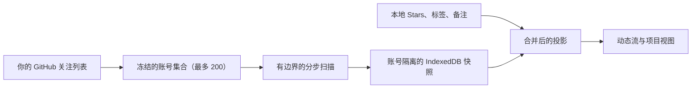

# Following 的工作方式

Following 把你关注的人最近 Star 的公开仓库整理成一条动态流。这里写清楚它扫描哪些账号、全量扫描如何在中断后继续、本地保存了什么，以及哪些覆盖缺口是永久的。英文版见 [How Following works](../en/following-strategy.md)。

## Following 的范围

Following 只回答一个问题：你在 GitHub 上关注的人，最近 Star 了哪些公开仓库。它是发现型界面，不是通知收件箱。结果可以按时间倒序平铺，也可以按仓库聚合。

它不是 GitHub 活动流：不读 commit、release、issue，也不追踪"关注的人关注了谁"，更不会从仓库元数据推断动态。

## 界面上有什么

每行显示 Star 的人、仓库、语言和 Star 数、Star 发生的时间，以及该仓库是否已在你的库中。本地标注在投影阶段合并，所以你已经打过标签的仓库会直接显示这些标签。

历史窗口是偏好设置：30、60 或 90 天。改变窗口会让已保存的全量基线失效——上一次扫描只证明了上一个窗口的覆盖范围。

## 扫描哪些账号

Following **最多扫描 200 个账号**，账号来自 GitHub 关注列表的分页结果；API 不保证按关注时间倒序返回。超出这个上限的账号不会被扫描。

这个上限是产品边界，不是 GitHub 的限制。它约束一个每小时后台刷新的界面在最坏情况下的配额开销。触发时快照会记录一个专门的原因，界面直接说明覆盖了多少个账号，不会把不完整的结果说成完整的。

这个原因和 GitHub 侧的缺口是刻意区分开的：触达上限是稳定且预期的，而关注列表分页失败是临时的扫描故障。只有后者会让扩展在下次唤醒时倾向重跑全量。

## 全量扫描如何工作

一次全量扫描不可能在单个请求内完成。GitHub 通过两组独立的分页 GraphQL 连接暴露关注列表和每个账号的 Star 列表，而扩展的 service worker 随时可能被回收。因此 Following 把带版本的 checkpoint 持久化在 IndexedDB 里，并以有边界的步骤推进。

一步的动作：

1. 翻关注列表，直到账号集合可以冻结。
2. 为待处理账号请求 Star 列表，每个请求覆盖 5 个账号。
3. 在第一个可恢复边界停下，只返回一个 checkpoint 版本号。

每步的限制：

| 控制项 | 当前行为 |
|---|---|
| 关注列表每页 | 100 个账号 |
| 账号扫描上限 | 200 个 |
| 每个请求的账号数 | 5 |
| 每个账号每页 Star 数 | 30 |
| 每步请求上限 | 10 次 |
| 每步截止时间 | 120 秒 |
| 单请求超时 | 30 秒 |
| 瞬时失败重试 | 每个请求位置 3 次 |
| 配额储备 | 保留 50 点不动用 |
| 自动检查 | 每小时一次 |
| 全量周期 | 每 7 天 |

三种边界会让一步暂停而不丢进度：请求预算、步骤截止时间和配额储备。暂停不是失败——存储的游标、已获取的记录和累积的覆盖缺口都会保留，下一次兼容的刷新从该游标继续，而不是从最新一页重新开始。

配额充足时，连续的步骤会在同一次唤醒内接着跑，所以大关注列表在几分钟内收敛，而不是横跨多次小时级 alarm。如果再执行一整步会让剩余配额低于储备值，链式执行立即停止，因此扫描不会动用为 Stars 同步、Watch 和 Cubby 预留的那部分配额。只有请求预算暂停才可能链式继续：截止时间暂停说明这次唤醒本来就慢，配额暂停则是必须等到 GitHub 重置时间的硬等待。当剩余配额或该步的请求成本未知时，链式执行同样停止——无法测量的一步可能花到储备以下。

Cutoff 在 epoch 开始时就冻结。几小时后恢复，覆盖的仍是这次扫描承诺的窗口，记录不会在扫描进行中悄悄漂移。

## 什么状态才能删除记录

全量凭证和删除权限是分开的，这是核心存储规则。

走完全部冻结账号直到冻结 cutoff，记录的是"一次全量扫描完成了"。删除记录要求严格更多：冻结的账号集合必须覆盖整个关注列表，且没有任何已知覆盖缺口。有上限或有缺口的 epoch 无法证明它没看到的记录已被取消 Star，所以它只合并已发现的内容，不删除任何东西。

值得明说的几个结论：

- 暂停、失败或被放弃的 epoch 永远不删除动态。
- 触达 200 个账号上限的 epoch 永远不删除动态。
- 本地已读和已忽略状态在每一步都保留，终局那一步也一样。
- 更换账号、凭据或历史窗口会放弃不兼容的进度，但不动已保存的记录。

## 刷新路由

未完成且兼容的 checkpoint 优先于常规策略：自动刷新、Refresh 和全量同步都会继续那个 epoch。没有 checkpoint 时，扩展这样选：

| 情形 | 计划 |
|---|---|
| 没有已保存基线 | 全量 |
| 上次尝试失败 | 全量 |
| 历史窗口改变 | 全量 |
| 凭据或账号改变 | 全量 |
| 上次全量已过 7 天 | 全量 |
| 其他 | 增量，固定 7 天回溯 |

永久性覆盖缺口不会触发全量。重跑全量拿不回 GitHub 在该窗口本就不返回的动态，为它升级只会每小时白花配额。

失败会写入冷却下限，避免自动刷新无间隔地重试同一个失败。显式点击全量同步可以穿透这个冷却——那是用户主动要求。GitHub 配额等待会拦住所有调用方，包括显式请求。

## 存储与隐私

GitHub 始终是关注列表和 Star 事件的权威来源。IndexedDB 保存账号隔离的缓存：

- `radarActivities`：标准化的 Star 事件，含本地已读和已忽略状态
- `radarState`：刷新时间、覆盖计数、配额元数据、错误状态，以及私有的 reconciliation checkpoint

Checkpoint 不跨越后台与界面的边界。公开状态只携带阶段、已完成／总数、更新时间、暂停原因和恢复时间。账号名、GraphQL 游标、epoch 标识和凭据指纹都留在存储层和数据源层内部。

Following 的数据默认不会进入标签、标签元数据、标注 Gist、日志、遥测或 Cubby。更换 GitHub 账号会清除上一个账号的 Following 缓存。

## 凭据与权限

Following 用保存的 Classic personal access token 读 GitHub GraphQL API，翻关注列表需要 `read:user`。缺少该 scope 时 Following 不可用，Stars、Gist 同步和 Watch 不受影响。

私有仓库动态会被省略而不是显示，这个省略会记录为一项覆盖缺口。

## 支持与不支持

| 方面 | 现在支持 | 不支持 |
|---|---|---|
| 扫描账号 | 最多 200 个关注账号 | 超出上限的完整关注列表 |
| 动态类型 | 公开 Star 事件 | commit、release、issue、关注或 fork |
| 历史范围 | 30、60 或 90 天滚动窗口 | 任意区间或完整历史 |
| 收敛方式 | 可恢复分步，配额允许时链式执行 | GitHub 的原子时间点快照 |
| 删除 | 仅完整无缺口的 epoch 可清理记录 | 从部分或有上限的 epoch 清理 |
| 标注 | 本地标签、备注和 Star 在投影时合并 | 把 Following 状态写回 GitHub |
| 同步 | 本地账号隔离的 IndexedDB 缓存 | Gist 同步或跨设备 Following 状态 |

## 参考

- [GitHub GraphQL API reference](https://docs.github.com/en/graphql/reference/queries)
- [GitHub GraphQL 速率与节点限制](https://docs.github.com/en/graphql/overview/rate-limits-and-node-limits-for-the-graphql-api)
- [GitHub REST starring 接口](https://docs.github.com/en/rest/activity/starring)
- [GitHub Classic PAT scopes](https://docs.github.com/en/apps/oauth-apps/building-oauth-apps/scopes-for-oauth-apps)
