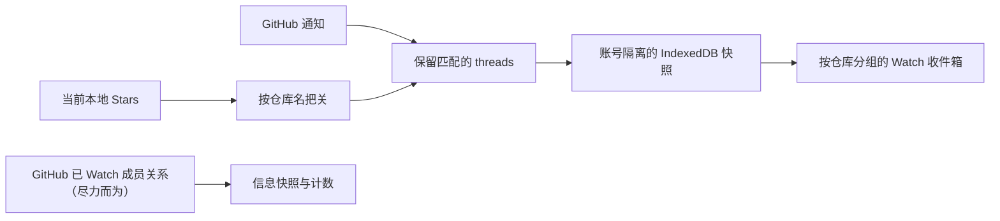

# Watch 的工作方式

Watch 把 GitHub 通知整理成按仓库分组的收件箱。这里写清楚它怎样选仓库、刷新通知和保存数据，也记录 GitHub API 的两个已知缺口：Custom 订阅能产生不出现在已 Watch 仓库接口里的通知 thread，而该接口本身也可能失去访问权限。英文版见 [How Watch works](../en/watch-strategy.md)。

## Watch 的范围

Watch 显示你当前已 Star 的仓库通知，方便直接在 Stars 工作台处理。原生已 Watch 成员关系是另一份尽力而为的信息快照，不决定哪些 thread 会出现。

它不是仓库动态页：不会把 commit、release 或仓库元数据拼成活动流，也不会显示当前 Stars 库以外的仓库通知。

## 收件箱里有什么

每条通知会显示：

- 仓库名
- 标题和 subject 类型
- GitHub 返回的通知原因
- 已读状态和更新时间
- 经过校验的 GitHub 链接

收件箱有“未读”和“全部”两种视图。搜索支持仓库名和标题，也可以按通知原因筛选。仓库分组可以折叠；分组内有新通知或通知发生变化时，它会自动展开。

展开 Issue 或 Pull Request 后，扩展会用主 GitHub 凭据按需读取详情，包括状态、作者、label、assignee、milestone、评论数和正文。其他 subject 类型只显示通知摘要和 GitHub 链接。

## 已 Watch 成员关系与 Inbox 范围

Watch 维护两个相互独立的投影：

- **Inbox 范围**来自当前本地 Stars（`!tombstone && viewer_has_starred !== false`）。发布到收件箱的每条通知 thread 都必须属于这个集合。
- **原生已 Watch 成员关系**是 `GET /user/subscriptions` 的尽力而为信息快照，每页读取 100 个，直到取完；它回答“当前 Stars 里哪些仓库我在 GitHub 上也 Watch 了”，只作为信息展示，不决定收件箱出现哪些 thread。

扩展会把已 Watch 快照与当前 Stars 取交集，让计数保持有意义，并排除已取消 Star 的仓库和 tombstone 记录。

范围刷新的规则：

- 只要有一页请求失败或数据格式不对，整次刷新就算失败；已获取的部分结果不会覆盖旧快照。
- 刷新成功后，新快照一次性替换旧快照。
- 失败则保留最近一次成功结果，并把状态记为 stale。
- 范围刷新失败不会阻塞 Inbox 刷新，替换范围也不会删除 Inbox 记录。

Watch 不会因为仓库不在 `GET /user/subscriptions` 里就认定它未被 Watch：GitHub 的 Custom 订阅可以产生通知 thread，而这些仓库永远不会出现在该接口中。

## 通知怎么刷新

只有保存的 Classic personal access token（PAT）经探测确认可以访问 Notifications，Watch 才会请求 `GET /notifications`。请求带有 `all=true`，所以结果同时包括已读和未读 thread。GitHub 按更新时间倒序返回。

发布的 thread 会与当前本地 Stars 取交集；原生已 Watch 成员关系不会过滤收件箱。某个当前已 Star 的仓库即使不在 `GET /user/subscriptions` 中，其 Custom 分类通知 thread 仍可能出现在收件箱里。当前 Stars 库以外的仓库通知仍然会被排除。

刷新限制如下：

| 控制项 | 当前行为 |
|---|---|
| 每页数量 | 50 个 thread，即接口上限 |
| 分页上限 | 10 页 |
| 候选上限 | 500 个 thread |
| 快照边界 | 同一轮请求共用一个固定的 `before` 时间 |
| 请求超时 | 每页 30 秒 |
| Inbox 自动检查 | 每分钟一次，同时遵守 GitHub 返回的轮询间隔 |
| Watch 范围检查 | 每小时一次 |

第一页请求会附带上次保存的 `Last-Modified`。如果 GitHub 返回 `304 Not Modified`，Watch 会在同一事务中保留仍属于当前 Stars 的缓存、清理已离开该集合的记录并更新时间。条件请求返回 `200` 时，响应会按 thread ID 合并，并通过同一个 live Stars 事务围栏提交。

Watch 也会遵守 `X-Poll-Interval`。冷却时间未结束时，手动点击“刷新”不会发出请求。候选通知超过 500 条时，Watch 仍会保存这次最新窗口，但将其标记为 truncated。

## 可以执行哪些操作

Watch 目前支持两种 GitHub Inbox 操作：

| Watch 操作 | GitHub 请求 | 本地结果 |
|---|---|---|
| 标记为已读 | `PATCH /notifications/threads/{thread_id}` | 将缓存记录改为已读 |
| 标记为完成 | `DELETE /notifications/threads/{thread_id}` | 删除缓存记录 |

操作顺序是先写 GitHub，成功后再更新 IndexedDB。对整个仓库执行批量操作时，目标是该仓库的所有缓存通知，不受当前搜索词或原因筛选影响。

GitHub API 还可以修改仓库和 thread 的订阅状态，但本扩展没有调用这些接口。Watch、Custom、Ignore 和取消 Watch 请在 [GitHub Watching 页面](https://github.com/watching)中设置。

目前也不支持 Save、标记为未读、取消订阅、自定义 Inbox 筛选器或 GitHub Done 归档。GitHub 接受“标记为完成”后，对应记录会从本地收件箱删除。

## Token 与权限

扩展只加密保存一个 GitHub Classic PAT。这个 token 的基础权限是 `repo` 和 `gist`；如果要使用 Watch，还要勾选 `notifications`。

- `repo`：Stars、私有仓库元数据，以及你有权查看的 Issue 或 Pull Request 详情
- `gist`：批注同步
- `notifications`：读取通知，以及标记已读、标记完成

虽然 GitHub 的 Notifications REST API 同时接受 `notifications` 或 `repo`，本项目仍会单独探测 `notifications`，避免把“主功能可用”和“Watch 可用”混在一起。缺少这项权限只会关闭 Watch，不影响 Stars 或 Gist 同步。

`notifications` 也允许修改仓库和 thread 的订阅状态，但本扩展不会使用。不要为 Watch 添加更宽的权限。

## 本地保存哪些数据

仓库 Watch 关系和通知状态以 GitHub 为准。IndexedDB 按账号保存三类缓存：

- `watchRepositories`：尽力而为的已 Watch 成员快照中的标准仓库名
- `watchNotificationThreads`：整理后的通知记录
- `watchState`：刷新时间、错误、条件请求校验值、冷却时间、数量和 truncated 状态

Issue 和 Pull Request 详情只放在有容量限制的内存缓存中，不写入持久化存储。PAT 加密保存在 `chrome.storage.local`，解密后的值只在内存中使用。

Watch 数据不会写入 tag、tag metadata、批注 Gist、日志或遥测，默认也不会发给 Cubby。切换 GitHub 账号会删除旧账号的 Watch 缓存。断开 Watch 会删除通知和刷新状态，但保留 Stars 与批注。

## GitHub API 的已知缺口

GitHub 于 2026 年 6 月 30 日公告，2026 年 7 月起将限制部分公开的 Watching API。`GET /repos/{owner}/{repo}/subscribers` 将只对管理员和协作者开放；`GET /users/{username}/subscriptions` 已进入弃用期，期间可能直接返回空列表，之后会被移除。

公告没有点名当前使用的认证接口 `GET /user/subscriptions`，这个接口也仍在 REST 参考文档中。不过，Watching 文档对 subscriptions 列表接口的限制写得更宽，无法据此保证认证接口以后一直可用。

Custom 订阅是第二个缺口：它可能产生不出现在 `GET /user/subscriptions` 里的 `/notifications` thread。因此 Watch 永远不会把“不在已 Watch 列表中”当作排除依据，同时仍然不推断 Custom 分类，也不承诺能列出全部已 Watch 仓库。

这两个缺口只影响信息性的已 Watch 快照。Inbox 不再依赖它：即使 `GET /user/subscriptions` 返回 `403` 或空列表，也只会让快照或计数退化，不会阻塞通知刷新，也不会隐藏当前 Stars 的 thread。

在 GitHub 进一步说明之前，设计应守住这些边界：

1. 不回退到已经弃用的 `GET /users/{username}/subscriptions`。
2. 不抓取 `https://github.com/watching` 或仓库页面。
3. GitHub 返回错误时保留上一次成功结果。
4. 对认证接口的成功空响应，产品文案要谨慎处理。
5. 不承诺 Watch 能列出全部已 Watch 仓库。

当前实现仍会接受 `GET /user/subscriptions` 的成功空响应，并清空缓存快照。如果 GitHub 将访问限制表现为 `200` 加空数组，界面就会像是你取消了所有 Watch。这是现有兼容性缺口；快照为空本身不能证明订阅已经消失。

## 接下来怎么改
当前设计已经不再依赖完整的已 Watch 仓库列表：扩展直接读取 `GET /notifications`，再与当前本地 Stars 取交集。此时 Watch 表示“当前 Stars 中出现过的 GitHub Inbox thread”，不再是“所有已 Star 且已 Watch 的仓库”。以后只有在 GitHub 暴露 Custom 分类成员关系时，才有必要重新审视已 Watch 列表。

也可以对选中的仓库逐个调用 `GET /repos/{owner}/{repo}/subscription`。这个接口能确认单个仓库的订阅状态，但扫描整个 Stars 库需要每个仓库发一次请求。在确定请求上限并验证限流行为前，不应这样做。

以后若要加入仓库订阅写操作，应继续使用现有的 `notifications` scope，并要求用户确认目标仓库。默认批量修改不合适，而且写操作本身也解决不了仓库列表发现问题。

## 功能边界

| 领域 | 目前支持 | 不支持 |
|---|---|---|
| Inbox 范围 | 当前本地 Stars 决定哪些仓库会出现 | Stars 库以外的仓库或其他用户的 Watch 列表 |
| 原生已 Watch 成员关系 | 尽力而为的 `GET /user/subscriptions` 快照与计数 | 完整的已 Watch 列表、Custom 分类推断或订阅修改 |
| Inbox | 最新窗口内的已读和未读 GitHub thread | 完整活动历史或 GitHub 的完整 Inbox 归档 |
| 详情 | 按需读取 Issue 和 Pull Request | 内联评论、review timeline、commit、release 或 discussion 详情 |
| 本地筛选 | 未读/全部、标题与仓库搜索、原因筛选 | 同步 GitHub 自定义筛选器 |
| 修改操作 | 标记为已读、标记为完成 | Save、标记为未读、取消订阅、静音 thread、修改 Watch/Custom/Ignore |
| 同步 | 按账号隔离的 IndexedDB 缓存 | Gist 同步、跨设备 Watch 状态或导出到 AI 服务 |

## 参考资料

- [GitHub Notifications REST API](https://docs.github.com/en/rest/activity/notifications)
- [GitHub Watching REST API](https://docs.github.com/en/rest/activity/watching)
- [GitHub 通知概念](https://docs.github.com/en/subscriptions-and-notifications/concepts/about-notifications)
- [GitHub 通知 Inbox 管理](https://docs.github.com/en/subscriptions-and-notifications/how-tos/viewing-and-triaging-notifications/managing-notifications-from-your-inbox)
- [GitHub 2026 年 6 月 30 日 Watching 访问限制公告](https://github.blog/changelog/2026-06-30-upcoming-access-restrictions-to-public-api-endpoints-and-ui-views/)
- [GitHub Classic PAT scopes](https://docs.github.com/en/apps/oauth-apps/building-oauth-apps/scopes-for-oauth-apps)
